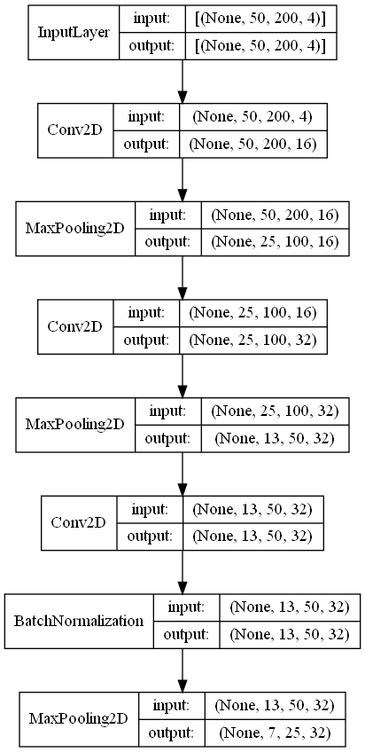
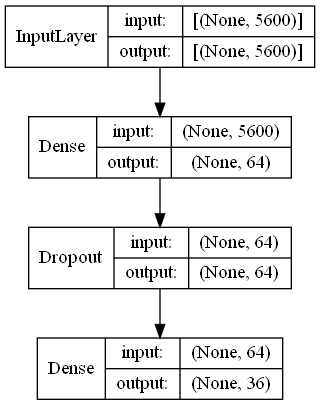
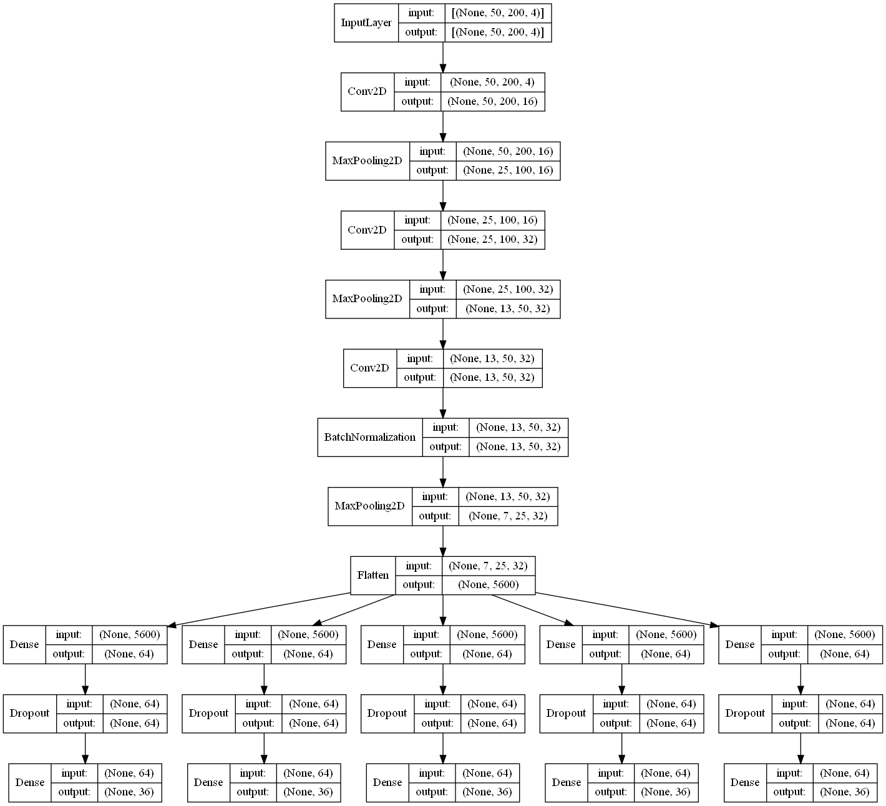
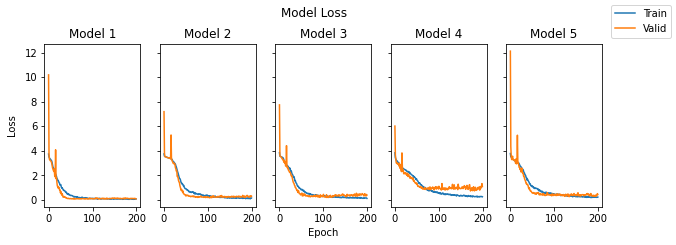
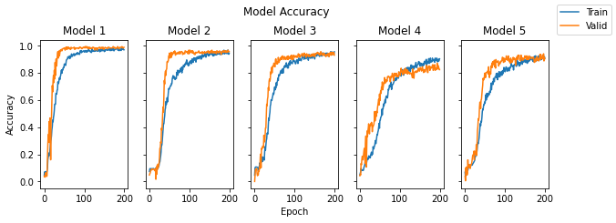
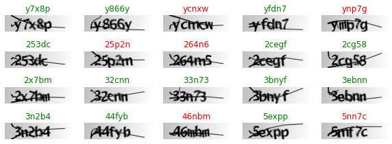

```python
import os, time
from datetime import datetime
file_mtime = datetime.fromtimestamp((os.path.getmtime("README.ipynb"))).strftime("%d/%m/%Y %H:%M:%S")
comp_time = datetime.now().strftime("%d/%m/%Y %H:%M:%S")

%matplotlib inline
```

# Breaking Text-Based CAPTCHA with Convolutional Nerual Network (CNN)


**Author**: Xiurui Zhu<br />
**Modified**: 10/11/2021 10:46:53<br />
**Compiled**: 10/11/2021 10:47:28


## Data preparation

Image files were loaded from the `png` files in `samples` directory.


```python
import glob
img_filenames = [f for f in glob.glob("samples/*.png")]
img_filenames_count = len(img_filenames)

import numpy as np
from matplotlib import pyplot
data_x = np.array(list(map(lambda x: pyplot.imread(x, format = "PNG"), img_filenames)))
```


A total of 1040 images were loaded. An example image was as follows:


```python
pyplot.imshow(data_x[0]);
pyplot.axis("off");
```


The labels were then loaded from the file names and turned them into a list of categorical matrices with one digit per element.


```python
# Define the number of digits and letters per CAPTCHA
import string
digit = 5
class_level = [*string.ascii_lowercase, *string.digits]

# Define a function to convert character vector to categorical matrix list
from tensorflow import keras
def labels2matrices(labels, class_level):
    char_ind_array = np.array([[class_level.index(char) for char in label] for label in labels])
    return list(map(lambda char_ind: keras.utils.to_categorical(char_ind, num_classes = len(class_level), dtype = 'float32'),
                    np.ndarray.tolist(np.transpose(char_ind_array))))

# Process image labels
data_y_labels = [os.path.splitext(os.path.basename(img_filename))[0] for img_filename in img_filenames]
data_y = labels2matrices(data_y_labels, class_level)
print(len(data_y))
print(np.shape(data_y[0]))
```

    5
    (1040, 36)
    

## Modeling

A CNN model was built to break the text-based CAPTCHA. A CNN model consists of two parts, one as convolutional model and the other as deep neural-network (DNN) model, joined by a flatten layer. Since there are multiple digits to predict for each CAPTCHA image, we would build the model including a common convolutional model, a common flatten layer and multiple DNN models (one for each digit).

### Convolutional model

The convolutional model (diagram as below) was built by adding multiple modules of convolutional and max-pooling layers, optionally adding a batch-normalization layer to improve model convergence.


```python
import tensorflow
from tensorflow import keras
from tensorflow.keras import layers
tensorflow.random.set_seed(599)

# Define the convolutional model
input_layer = keras.Input(shape = np.shape(data_x)[1:])
conv_layer = layers.Conv2D(16, kernel_size = (3, 3), padding = "same", activation = "relu")(input_layer)
conv_layer = layers.MaxPooling2D(pool_size = (2, 2), padding = "same")(conv_layer)
conv_layer = layers.Conv2D(32, kernel_size = (3, 3), padding = "same", activation = "relu")(conv_layer)
conv_layer = layers.MaxPooling2D(pool_size = (2, 2), padding = "same")(conv_layer)
conv_layer = layers.Conv2D(32, kernel_size = (3, 3), padding = "same", activation = "relu")(conv_layer)
conv_layer = layers.BatchNormalization()(conv_layer)
conv_layer = layers.MaxPooling2D(pool_size = (2, 2), padding = "same")(conv_layer)
conv_layer_flatten = layers.Flatten()(conv_layer)

conv_model = keras.Model(inputs = input_layer, outputs = conv_layer)

keras.utils.plot_model(conv_model, to_file = "conv_model.png", show_shapes = True, show_layer_names = False)
```





### Deep neural network (DNN) models

Each DNN model (diagram as below) was built with a hidden layer and a dropout layer, with the latter as a regularization method to prevent overfitting. The output layer of each DNN model adopted a multi-class configuration with the unit as the number of possibilities per digit and activation function as "softmax". The input layer of each DNN model was copied from the shape of the output from the flatten layer.


```python
# Define a function that copies the shape of a layer and defines an input layer
def build_deep_layer(input_layer, class_level):
    deep_layer = layers.Dense(64, activation = "relu")(input_layer)
    deep_layer = layers.Dropout(0.5)(deep_layer)
    deep_layer = layers.Dense(len(class_level), activation = "softmax")(deep_layer)
    return deep_layer

deep_layers = [
    build_deep_layer(conv_layer_flatten, class_level) for _ in range(digit)
]

deep_models = [keras.Model(inputs = conv_layer_flatten, outputs = deep_layer) for deep_layer in deep_layers]

keras.utils.plot_model(deep_models[0], to_file = "deep_model.png", show_shapes = True, show_layer_names = False)
```





### Assembled CNN model

The convolutional model and the DNN models were assembled into a final CNN model (diagram as below) and the final CNN model was compiled for training.


```python
model = keras.Model(
    inputs = input_layer,
    outputs = deep_layers
)

keras.utils.plot_model(model, to_file = "final_model.png", show_shapes = True, show_layer_names = False)
```





```python
n_train = 940
n_test = img_filenames_count - n_train
cv_frac = 0.2
```

## Results

### Model training


The final CNN model was trained with 940 images with 20.0% of them as cross-validation dataset.


```python
from numpy import random
random.seed(999)
train_idx = random.choice(range(img_filenames_count), size = n_train, replace = False, p = None)

data_y_train = [data_y_digit[train_idx] for data_y_digit in data_y]

# Compile the final model
model.compile(loss = "categorical_crossentropy", optimizer = "adam", metrics = ["accuracy"])
# Train model
model_history = model.fit(data_x[train_idx], data_y_train, batch_size = 32, epochs = 200, validation_split = cv_frac)
model.save("final_model")
```

    Epoch 1/200
    24/24 [==============================] - 11s 299ms/step - loss: 18.9387 - dense_1_loss: 3.7356 - dense_3_loss: 3.7454 - dense_5_loss: 3.8446 - dense_7_loss: 3.8339 - dense_9_loss: 3.7792 - dense_1_accuracy: 0.0465 - dense_3_accuracy: 0.0731 - dense_5_accuracy: 0.0465 - dense_7_accuracy: 0.0479 - dense_9_accuracy: 0.0678 - val_loss: 43.2619 - val_dense_1_loss: 10.1897 - val_dense_3_loss: 7.1901 - val_dense_5_loss: 7.7431 - val_dense_7_loss: 6.0145 - val_dense_9_loss: 12.1245 - val_dense_1_accuracy: 0.0372 - val_dense_3_accuracy: 0.0479 - val_dense_5_accuracy: 0.0000e+00 - val_dense_7_accuracy: 0.0426 - val_dense_9_accuracy: 0.0372
    Epoch 2/200
    24/24 [==============================] - 6s 235ms/step - loss: 17.5690 - dense_1_loss: 3.4885 - dense_3_loss: 3.5591 - dense_5_loss: 3.5605 - dense_7_loss: 3.4381 - dense_9_loss: 3.5227 - dense_1_accuracy: 0.0705 - dense_3_accuracy: 0.0944 - dense_5_accuracy: 0.0997 - dense_7_accuracy: 0.0598 - dense_9_accuracy: 0.0346 - val_loss: 19.1304 - val_dense_1_loss: 3.6692 - val_dense_3_loss: 3.8136 - val_dense_5_loss: 3.6221 - val_dense_7_loss: 3.6702 - val_dense_9_loss: 4.3553 - val_dense_1_accuracy: 0.0426 - val_dense_3_accuracy: 0.0585 - val_dense_5_accuracy: 0.0426 - val_dense_7_accuracy: 0.0532 - val_dense_9_accuracy: 0.0053
    Epoch 3/200
    24/24 [==============================] - 5s 228ms/step - loss: 17.3146 - dense_1_loss: 3.4219 - dense_3_loss: 3.5424 - dense_5_loss: 3.5443 - dense_7_loss: 3.3261 - dense_9_loss: 3.4799 - dense_1_accuracy: 0.0678 - dense_3_accuracy: 0.0944 - dense_5_accuracy: 0.1064 - dense_7_accuracy: 0.0731 - dense_9_accuracy: 0.0838 - val_loss: 17.1801 - val_dense_1_loss: 3.3014 - val_dense_3_loss: 3.5223 - val_dense_5_loss: 3.5365 - val_dense_7_loss: 3.3101 - val_dense_9_loss: 3.5098 - val_dense_1_accuracy: 0.0319 - val_dense_3_accuracy: 0.0638 - val_dense_5_accuracy: 0.0904 - val_dense_7_accuracy: 0.0479 - val_dense_9_accuracy: 0.1011
    Epoch 4/200
    24/24 [==============================] - 6s 230ms/step - loss: 17.1124 - dense_1_loss: 3.3580 - dense_3_loss: 3.5262 - dense_5_loss: 3.5283 - dense_7_loss: 3.2580 - dense_9_loss: 3.4420 - dense_1_accuracy: 0.0559 - dense_3_accuracy: 0.0944 - dense_5_accuracy: 0.1064 - dense_7_accuracy: 0.0957 - dense_9_accuracy: 0.0838 - val_loss: 16.6006 - val_dense_1_loss: 3.2506 - val_dense_3_loss: 3.5115 - val_dense_5_loss: 3.5208 - val_dense_7_loss: 3.0311 - val_dense_9_loss: 3.2867 - val_dense_1_accuracy: 0.0638 - val_dense_3_accuracy: 0.0798 - val_dense_5_accuracy: 0.0904 - val_dense_7_accuracy: 0.1330 - val_dense_9_accuracy: 0.0479
    Epoch 5/200
    24/24 [==============================] - 5s 230ms/step - loss: 16.9429 - dense_1_loss: 3.3268 - dense_3_loss: 3.5106 - dense_5_loss: 3.5127 - dense_7_loss: 3.1736 - dense_9_loss: 3.4192 - dense_1_accuracy: 0.0731 - dense_3_accuracy: 0.0944 - dense_5_accuracy: 0.1064 - dense_7_accuracy: 0.0824 - dense_9_accuracy: 0.0944 - val_loss: 16.5643 - val_dense_1_loss: 3.1955 - val_dense_3_loss: 3.4958 - val_dense_5_loss: 3.5049 - val_dense_7_loss: 2.9689 - val_dense_9_loss: 3.3992 - val_dense_1_accuracy: 0.0638 - val_dense_3_accuracy: 0.0851 - val_dense_5_accuracy: 0.0904 - val_dense_7_accuracy: 0.1223 - val_dense_9_accuracy: 0.1064
    Epoch 6/200
    24/24 [==============================] - 6s 238ms/step - loss: 16.7887 - dense_1_loss: 3.2819 - dense_3_loss: 3.4951 - dense_5_loss: 3.4977 - dense_7_loss: 3.1718 - dense_9_loss: 3.3422 - dense_1_accuracy: 0.0625 - dense_3_accuracy: 0.0944 - dense_5_accuracy: 0.1064 - dense_7_accuracy: 0.0824 - dense_9_accuracy: 0.0878 - val_loss: 16.6538 - val_dense_1_loss: 3.1717 - val_dense_3_loss: 3.4873 - val_dense_5_loss: 3.4033 - val_dense_7_loss: 3.0287 - val_dense_9_loss: 3.5627 - val_dense_1_accuracy: 0.0532 - val_dense_3_accuracy: 0.0904 - val_dense_5_accuracy: 0.0957 - val_dense_7_accuracy: 0.1649 - val_dense_9_accuracy: 0.0479
    Epoch 7/200
    24/24 [==============================] - 6s 233ms/step - loss: 16.6319 - dense_1_loss: 3.2376 - dense_3_loss: 3.4806 - dense_5_loss: 3.4826 - dense_7_loss: 3.1277 - dense_9_loss: 3.3034 - dense_1_accuracy: 0.0691 - dense_3_accuracy: 0.0944 - dense_5_accuracy: 0.1051 - dense_7_accuracy: 0.0824 - dense_9_accuracy: 0.0824 - val_loss: 16.1813 - val_dense_1_loss: 3.1325 - val_dense_3_loss: 3.4659 - val_dense_5_loss: 3.3919 - val_dense_7_loss: 2.9312 - val_dense_9_loss: 3.2597 - val_dense_1_accuracy: 0.0372 - val_dense_3_accuracy: 0.0851 - val_dense_5_accuracy: 0.0585 - val_dense_7_accuracy: 0.1862 - val_dense_9_accuracy: 0.0638
    Epoch 8/200
    24/24 [==============================] - 6s 232ms/step - loss: 16.4465 - dense_1_loss: 3.1785 - dense_3_loss: 3.4678 - dense_5_loss: 3.4448 - dense_7_loss: 3.0670 - dense_9_loss: 3.2883 - dense_1_accuracy: 0.0785 - dense_3_accuracy: 0.0918 - dense_5_accuracy: 0.1037 - dense_7_accuracy: 0.0864 - dense_9_accuracy: 0.0811 - val_loss: 15.9511 - val_dense_1_loss: 3.0068 - val_dense_3_loss: 3.4620 - val_dense_5_loss: 3.2877 - val_dense_7_loss: 2.9078 - val_dense_9_loss: 3.2868 - val_dense_1_accuracy: 0.0426 - val_dense_3_accuracy: 0.0904 - val_dense_5_accuracy: 0.0426 - val_dense_7_accuracy: 0.1649 - val_dense_9_accuracy: 0.1596
    Epoch 9/200
    24/24 [==============================] - 6s 234ms/step - loss: 16.2263 - dense_1_loss: 3.0478 - dense_3_loss: 3.4521 - dense_5_loss: 3.4413 - dense_7_loss: 3.0257 - dense_9_loss: 3.2594 - dense_1_accuracy: 0.1011 - dense_3_accuracy: 0.0944 - dense_5_accuracy: 0.1024 - dense_7_accuracy: 0.0811 - dense_9_accuracy: 0.0984 - val_loss: 15.8099 - val_dense_1_loss: 2.8387 - val_dense_3_loss: 3.4486 - val_dense_5_loss: 3.3007 - val_dense_7_loss: 2.9465 - val_dense_9_loss: 3.2755 - val_dense_1_accuracy: 0.1809 - val_dense_3_accuracy: 0.0904 - val_dense_5_accuracy: 0.0479 - val_dense_7_accuracy: 0.1596 - val_dense_9_accuracy: 0.1011
    Epoch 10/200
    24/24 [==============================] - 6s 230ms/step - loss: 15.8778 - dense_1_loss: 2.8570 - dense_3_loss: 3.4386 - dense_5_loss: 3.3688 - dense_7_loss: 3.0042 - dense_9_loss: 3.2092 - dense_1_accuracy: 0.1622 - dense_3_accuracy: 0.0944 - dense_5_accuracy: 0.0785 - dense_7_accuracy: 0.0838 - dense_9_accuracy: 0.1037 - val_loss: 15.2389 - val_dense_1_loss: 2.6111 - val_dense_3_loss: 3.4358 - val_dense_5_loss: 3.2069 - val_dense_7_loss: 2.7729 - val_dense_9_loss: 3.2122 - val_dense_1_accuracy: 0.2766 - val_dense_3_accuracy: 0.0904 - val_dense_5_accuracy: 0.0479 - val_dense_7_accuracy: 0.1915 - val_dense_9_accuracy: 0.1223
    Epoch 11/200
    24/24 [==============================] - 6s 235ms/step - loss: 15.4284 - dense_1_loss: 2.6567 - dense_3_loss: 3.4271 - dense_5_loss: 3.2614 - dense_7_loss: 2.8981 - dense_9_loss: 3.1851 - dense_1_accuracy: 0.1822 - dense_3_accuracy: 0.0957 - dense_5_accuracy: 0.0878 - dense_7_accuracy: 0.1024 - dense_9_accuracy: 0.1184 - val_loss: 15.2128 - val_dense_1_loss: 2.4971 - val_dense_3_loss: 3.4232 - val_dense_5_loss: 3.0697 - val_dense_7_loss: 3.0002 - val_dense_9_loss: 3.2225 - val_dense_1_accuracy: 0.3457 - val_dense_3_accuracy: 0.0904 - val_dense_5_accuracy: 0.0798 - val_dense_7_accuracy: 0.2234 - val_dense_9_accuracy: 0.1117
    Epoch 12/200
    24/24 [==============================] - 5s 227ms/step - loss: 15.2551 - dense_1_loss: 2.6220 - dense_3_loss: 3.4127 - dense_5_loss: 3.1828 - dense_7_loss: 2.8853 - dense_9_loss: 3.1522 - dense_1_accuracy: 0.1968 - dense_3_accuracy: 0.0944 - dense_5_accuracy: 0.1051 - dense_7_accuracy: 0.1104 - dense_9_accuracy: 0.1237 - val_loss: 14.8114 - val_dense_1_loss: 2.3970 - val_dense_3_loss: 3.4118 - val_dense_5_loss: 3.2059 - val_dense_7_loss: 2.6246 - val_dense_9_loss: 3.1721 - val_dense_1_accuracy: 0.3032 - val_dense_3_accuracy: 0.0904 - val_dense_5_accuracy: 0.0745 - val_dense_7_accuracy: 0.2447 - val_dense_9_accuracy: 0.1223
    Epoch 13/200
    24/24 [==============================] - 6s 232ms/step - loss: 14.9491 - dense_1_loss: 2.4894 - dense_3_loss: 3.4181 - dense_5_loss: 3.1117 - dense_7_loss: 2.8023 - dense_9_loss: 3.1275 - dense_1_accuracy: 0.2101 - dense_3_accuracy: 0.0878 - dense_5_accuracy: 0.1170 - dense_7_accuracy: 0.1197 - dense_9_accuracy: 0.1157 - val_loss: 14.2643 - val_dense_1_loss: 2.3133 - val_dense_3_loss: 3.3993 - val_dense_5_loss: 3.0099 - val_dense_7_loss: 2.5693 - val_dense_9_loss: 2.9724 - val_dense_1_accuracy: 0.4415 - val_dense_3_accuracy: 0.0904 - val_dense_5_accuracy: 0.1064 - val_dense_7_accuracy: 0.2234 - val_dense_9_accuracy: 0.1223
    Epoch 14/200
    24/24 [==============================] - 6s 229ms/step - loss: 14.6892 - dense_1_loss: 2.4030 - dense_3_loss: 3.3909 - dense_5_loss: 2.9855 - dense_7_loss: 2.7661 - dense_9_loss: 3.1436 - dense_1_accuracy: 0.1902 - dense_3_accuracy: 0.0918 - dense_5_accuracy: 0.1383 - dense_7_accuracy: 0.1396 - dense_9_accuracy: 0.1117 - val_loss: 15.2550 - val_dense_1_loss: 2.5108 - val_dense_3_loss: 3.4520 - val_dense_5_loss: 3.0744 - val_dense_7_loss: 2.8752 - val_dense_9_loss: 3.3426 - val_dense_1_accuracy: 0.2872 - val_dense_3_accuracy: 0.0798 - val_dense_5_accuracy: 0.0957 - val_dense_7_accuracy: 0.1330 - val_dense_9_accuracy: 0.0957
    Epoch 15/200
    24/24 [==============================] - 6s 234ms/step - loss: 14.5221 - dense_1_loss: 2.3445 - dense_3_loss: 3.3774 - dense_5_loss: 3.0231 - dense_7_loss: 2.6845 - dense_9_loss: 3.0925 - dense_1_accuracy: 0.2221 - dense_3_accuracy: 0.0878 - dense_5_accuracy: 0.1290 - dense_7_accuracy: 0.1316 - dense_9_accuracy: 0.1184 - val_loss: 13.4398 - val_dense_1_loss: 1.9433 - val_dense_3_loss: 3.3770 - val_dense_5_loss: 2.7575 - val_dense_7_loss: 2.4266 - val_dense_9_loss: 2.9354 - val_dense_1_accuracy: 0.4681 - val_dense_3_accuracy: 0.0904 - val_dense_5_accuracy: 0.1809 - val_dense_7_accuracy: 0.2766 - val_dense_9_accuracy: 0.1223
    Epoch 16/200
    24/24 [==============================] - 6s 248ms/step - loss: 14.2939 - dense_1_loss: 2.1833 - dense_3_loss: 3.3654 - dense_5_loss: 2.9393 - dense_7_loss: 2.6974 - dense_9_loss: 3.1085 - dense_1_accuracy: 0.2553 - dense_3_accuracy: 0.0944 - dense_5_accuracy: 0.1290 - dense_7_accuracy: 0.1263 - dense_9_accuracy: 0.1184 - val_loss: 13.3326 - val_dense_1_loss: 1.8789 - val_dense_3_loss: 3.3665 - val_dense_5_loss: 2.7564 - val_dense_7_loss: 2.3042 - val_dense_9_loss: 3.0265 - val_dense_1_accuracy: 0.4309 - val_dense_3_accuracy: 0.0904 - val_dense_5_accuracy: 0.2021 - val_dense_7_accuracy: 0.3351 - val_dense_9_accuracy: 0.1223
    Epoch 17/200
    24/24 [==============================] - 6s 241ms/step - loss: 13.9992 - dense_1_loss: 2.1026 - dense_3_loss: 3.3510 - dense_5_loss: 2.8552 - dense_7_loss: 2.6114 - dense_9_loss: 3.0790 - dense_1_accuracy: 0.2965 - dense_3_accuracy: 0.0997 - dense_5_accuracy: 0.1449 - dense_7_accuracy: 0.1503 - dense_9_accuracy: 0.1210 - val_loss: 22.8930 - val_dense_1_loss: 4.0817 - val_dense_3_loss: 5.2913 - val_dense_5_loss: 4.4202 - val_dense_7_loss: 3.8279 - val_dense_9_loss: 5.2719 - val_dense_1_accuracy: 0.1596 - val_dense_3_accuracy: 0.0160 - val_dense_5_accuracy: 0.1011 - val_dense_7_accuracy: 0.1064 - val_dense_9_accuracy: 0.1277
    Epoch 18/200
    24/24 [==============================] - 6s 244ms/step - loss: 13.8916 - dense_1_loss: 2.0307 - dense_3_loss: 3.3328 - dense_5_loss: 2.8273 - dense_7_loss: 2.6201 - dense_9_loss: 3.0807 - dense_1_accuracy: 0.3112 - dense_3_accuracy: 0.0931 - dense_5_accuracy: 0.1529 - dense_7_accuracy: 0.1410 - dense_9_accuracy: 0.1210 - val_loss: 13.3827 - val_dense_1_loss: 1.7403 - val_dense_3_loss: 3.2777 - val_dense_5_loss: 2.6856 - val_dense_7_loss: 2.6180 - val_dense_9_loss: 3.0610 - val_dense_1_accuracy: 0.4628 - val_dense_3_accuracy: 0.1011 - val_dense_5_accuracy: 0.2447 - val_dense_7_accuracy: 0.2234 - val_dense_9_accuracy: 0.1436
    Epoch 19/200
    24/24 [==============================] - 6s 236ms/step - loss: 13.6360 - dense_1_loss: 1.9133 - dense_3_loss: 3.3184 - dense_5_loss: 2.7901 - dense_7_loss: 2.5909 - dense_9_loss: 3.0233 - dense_1_accuracy: 0.3351 - dense_3_accuracy: 0.1037 - dense_5_accuracy: 0.1449 - dense_7_accuracy: 0.1609 - dense_9_accuracy: 0.1210 - val_loss: 13.0365 - val_dense_1_loss: 1.8033 - val_dense_3_loss: 3.2512 - val_dense_5_loss: 2.6087 - val_dense_7_loss: 2.3322 - val_dense_9_loss: 3.0410 - val_dense_1_accuracy: 0.4681 - val_dense_3_accuracy: 0.0532 - val_dense_5_accuracy: 0.2394 - val_dense_7_accuracy: 0.3723 - val_dense_9_accuracy: 0.1702
    Epoch 20/200
    24/24 [==============================] - 6s 236ms/step - loss: 13.1993 - dense_1_loss: 1.7521 - dense_3_loss: 3.2430 - dense_5_loss: 2.6662 - dense_7_loss: 2.5282 - dense_9_loss: 3.0098 - dense_1_accuracy: 0.3816 - dense_3_accuracy: 0.0904 - dense_5_accuracy: 0.1822 - dense_7_accuracy: 0.1729 - dense_9_accuracy: 0.1316 - val_loss: 12.4806 - val_dense_1_loss: 1.4022 - val_dense_3_loss: 3.1360 - val_dense_5_loss: 2.6657 - val_dense_7_loss: 2.4256 - val_dense_9_loss: 2.8512 - val_dense_1_accuracy: 0.5904 - val_dense_3_accuracy: 0.1170 - val_dense_5_accuracy: 0.2447 - val_dense_7_accuracy: 0.3298 - val_dense_9_accuracy: 0.1915
    Epoch 21/200
    24/24 [==============================] - 6s 249ms/step - loss: 13.0658 - dense_1_loss: 1.7003 - dense_3_loss: 3.1689 - dense_5_loss: 2.7297 - dense_7_loss: 2.5301 - dense_9_loss: 2.9367 - dense_1_accuracy: 0.4043 - dense_3_accuracy: 0.0904 - dense_5_accuracy: 0.1489 - dense_7_accuracy: 0.1609 - dense_9_accuracy: 0.1330 - val_loss: 11.4149 - val_dense_1_loss: 1.1265 - val_dense_3_loss: 3.0655 - val_dense_5_loss: 2.4408 - val_dense_7_loss: 2.1306 - val_dense_9_loss: 2.6515 - val_dense_1_accuracy: 0.7074 - val_dense_3_accuracy: 0.0904 - val_dense_5_accuracy: 0.2606 - val_dense_7_accuracy: 0.3723 - val_dense_9_accuracy: 0.1968
    Epoch 22/200
    24/24 [==============================] - 6s 247ms/step - loss: 12.6758 - dense_1_loss: 1.5716 - dense_3_loss: 3.1271 - dense_5_loss: 2.6077 - dense_7_loss: 2.4993 - dense_9_loss: 2.8700 - dense_1_accuracy: 0.4521 - dense_3_accuracy: 0.0984 - dense_5_accuracy: 0.1582 - dense_7_accuracy: 0.1702 - dense_9_accuracy: 0.1396 - val_loss: 11.3696 - val_dense_1_loss: 1.1138 - val_dense_3_loss: 2.9737 - val_dense_5_loss: 2.4564 - val_dense_7_loss: 2.1796 - val_dense_9_loss: 2.6460 - val_dense_1_accuracy: 0.6596 - val_dense_3_accuracy: 0.1277 - val_dense_5_accuracy: 0.2553 - val_dense_7_accuracy: 0.3936 - val_dense_9_accuracy: 0.1968
    Epoch 23/200
    24/24 [==============================] - 6s 248ms/step - loss: 12.5051 - dense_1_loss: 1.5743 - dense_3_loss: 3.0865 - dense_5_loss: 2.6131 - dense_7_loss: 2.4786 - dense_9_loss: 2.7525 - dense_1_accuracy: 0.4402 - dense_3_accuracy: 0.1024 - dense_5_accuracy: 0.1755 - dense_7_accuracy: 0.1888 - dense_9_accuracy: 0.1436 - val_loss: 10.8770 - val_dense_1_loss: 0.9489 - val_dense_3_loss: 2.9764 - val_dense_5_loss: 2.3129 - val_dense_7_loss: 2.1599 - val_dense_9_loss: 2.4790 - val_dense_1_accuracy: 0.7500 - val_dense_3_accuracy: 0.1064 - val_dense_5_accuracy: 0.2500 - val_dense_7_accuracy: 0.4255 - val_dense_9_accuracy: 0.2234
    Epoch 24/200
    24/24 [==============================] - 6s 244ms/step - loss: 12.2966 - dense_1_loss: 1.4916 - dense_3_loss: 3.0695 - dense_5_loss: 2.5383 - dense_7_loss: 2.4598 - dense_9_loss: 2.7374 - dense_1_accuracy: 0.4734 - dense_3_accuracy: 0.1090 - dense_5_accuracy: 0.1729 - dense_7_accuracy: 0.1729 - dense_9_accuracy: 0.1489 - val_loss: 10.8785 - val_dense_1_loss: 1.0497 - val_dense_3_loss: 2.9300 - val_dense_5_loss: 2.2535 - val_dense_7_loss: 2.1212 - val_dense_9_loss: 2.5241 - val_dense_1_accuracy: 0.7819 - val_dense_3_accuracy: 0.1277 - val_dense_5_accuracy: 0.3404 - val_dense_7_accuracy: 0.3989 - val_dense_9_accuracy: 0.1596
    Epoch 25/200
    24/24 [==============================] - 6s 243ms/step - loss: 12.1241 - dense_1_loss: 1.3941 - dense_3_loss: 2.9895 - dense_5_loss: 2.5821 - dense_7_loss: 2.4467 - dense_9_loss: 2.7117 - dense_1_accuracy: 0.4907 - dense_3_accuracy: 0.1197 - dense_5_accuracy: 0.1582 - dense_7_accuracy: 0.1795 - dense_9_accuracy: 0.1556 - val_loss: 10.7463 - val_dense_1_loss: 0.9774 - val_dense_3_loss: 2.9784 - val_dense_5_loss: 2.2741 - val_dense_7_loss: 2.2281 - val_dense_9_loss: 2.2883 - val_dense_1_accuracy: 0.7287 - val_dense_3_accuracy: 0.1330 - val_dense_5_accuracy: 0.2926 - val_dense_7_accuracy: 0.3511 - val_dense_9_accuracy: 0.2234
    Epoch 26/200
    24/24 [==============================] - 6s 250ms/step - loss: 11.7518 - dense_1_loss: 1.3602 - dense_3_loss: 2.9599 - dense_5_loss: 2.4294 - dense_7_loss: 2.4007 - dense_9_loss: 2.6017 - dense_1_accuracy: 0.5226 - dense_3_accuracy: 0.1423 - dense_5_accuracy: 0.2194 - dense_7_accuracy: 0.1875 - dense_9_accuracy: 0.1809 - val_loss: 10.3082 - val_dense_1_loss: 0.8081 - val_dense_3_loss: 2.8448 - val_dense_5_loss: 2.1917 - val_dense_7_loss: 2.1339 - val_dense_9_loss: 2.3296 - val_dense_1_accuracy: 0.8191 - val_dense_3_accuracy: 0.1755 - val_dense_5_accuracy: 0.2926 - val_dense_7_accuracy: 0.4096 - val_dense_9_accuracy: 0.2181
    Epoch 27/200
    24/24 [==============================] - 6s 236ms/step - loss: 11.3703 - dense_1_loss: 1.1999 - dense_3_loss: 2.9044 - dense_5_loss: 2.2609 - dense_7_loss: 2.4048 - dense_9_loss: 2.6003 - dense_1_accuracy: 0.5691 - dense_3_accuracy: 0.1436 - dense_5_accuracy: 0.2566 - dense_7_accuracy: 0.1742 - dense_9_accuracy: 0.1822 - val_loss: 10.1969 - val_dense_1_loss: 0.8153 - val_dense_3_loss: 2.6167 - val_dense_5_loss: 2.0753 - val_dense_7_loss: 2.0940 - val_dense_9_loss: 2.5955 - val_dense_1_accuracy: 0.7553 - val_dense_3_accuracy: 0.2447 - val_dense_5_accuracy: 0.3298 - val_dense_7_accuracy: 0.4096 - val_dense_9_accuracy: 0.2021
    Epoch 28/200
    24/24 [==============================] - 6s 257ms/step - loss: 11.2405 - dense_1_loss: 1.2360 - dense_3_loss: 2.7696 - dense_5_loss: 2.3493 - dense_7_loss: 2.3537 - dense_9_loss: 2.5319 - dense_1_accuracy: 0.5705 - dense_3_accuracy: 0.1649 - dense_5_accuracy: 0.2301 - dense_7_accuracy: 0.1968 - dense_9_accuracy: 0.1968 - val_loss: 9.2789 - val_dense_1_loss: 0.5764 - val_dense_3_loss: 2.5349 - val_dense_5_loss: 1.9387 - val_dense_7_loss: 1.9996 - val_dense_9_loss: 2.2292 - val_dense_1_accuracy: 0.8777 - val_dense_3_accuracy: 0.2447 - val_dense_5_accuracy: 0.3936 - val_dense_7_accuracy: 0.4255 - val_dense_9_accuracy: 0.2074
    Epoch 29/200
    24/24 [==============================] - 6s 244ms/step - loss: 10.8712 - dense_1_loss: 1.2303 - dense_3_loss: 2.6818 - dense_5_loss: 2.1861 - dense_7_loss: 2.2909 - dense_9_loss: 2.4821 - dense_1_accuracy: 0.5691 - dense_3_accuracy: 0.1888 - dense_5_accuracy: 0.2699 - dense_7_accuracy: 0.2061 - dense_9_accuracy: 0.1941 - val_loss: 9.3675 - val_dense_1_loss: 0.6840 - val_dense_3_loss: 2.3435 - val_dense_5_loss: 1.9804 - val_dense_7_loss: 2.1721 - val_dense_9_loss: 2.1875 - val_dense_1_accuracy: 0.7819 - val_dense_3_accuracy: 0.2926 - val_dense_5_accuracy: 0.3936 - val_dense_7_accuracy: 0.4149 - val_dense_9_accuracy: 0.2713
    Epoch 30/200
    24/24 [==============================] - 6s 235ms/step - loss: 10.4414 - dense_1_loss: 1.0395 - dense_3_loss: 2.5430 - dense_5_loss: 2.0878 - dense_7_loss: 2.2984 - dense_9_loss: 2.4727 - dense_1_accuracy: 0.6489 - dense_3_accuracy: 0.2181 - dense_5_accuracy: 0.3019 - dense_7_accuracy: 0.2168 - dense_9_accuracy: 0.2074 - val_loss: 8.8504 - val_dense_1_loss: 0.4875 - val_dense_3_loss: 2.3830 - val_dense_5_loss: 1.8071 - val_dense_7_loss: 1.9802 - val_dense_9_loss: 2.1926 - val_dense_1_accuracy: 0.8989 - val_dense_3_accuracy: 0.2819 - val_dense_5_accuracy: 0.4734 - val_dense_7_accuracy: 0.4362 - val_dense_9_accuracy: 0.1915
    Epoch 31/200
    24/24 [==============================] - 6s 233ms/step - loss: 10.0718 - dense_1_loss: 0.9662 - dense_3_loss: 2.4070 - dense_5_loss: 2.0469 - dense_7_loss: 2.3189 - dense_9_loss: 2.3327 - dense_1_accuracy: 0.6476 - dense_3_accuracy: 0.2660 - dense_5_accuracy: 0.3138 - dense_7_accuracy: 0.1928 - dense_9_accuracy: 0.2314 - val_loss: 7.7524 - val_dense_1_loss: 0.3905 - val_dense_3_loss: 1.9083 - val_dense_5_loss: 1.6038 - val_dense_7_loss: 1.9060 - val_dense_9_loss: 1.9438 - val_dense_1_accuracy: 0.9043 - val_dense_3_accuracy: 0.3936 - val_dense_5_accuracy: 0.5691 - val_dense_7_accuracy: 0.4202 - val_dense_9_accuracy: 0.2819
    Epoch 32/200
    24/24 [==============================] - 6s 238ms/step - loss: 9.7214 - dense_1_loss: 0.9926 - dense_3_loss: 2.2832 - dense_5_loss: 1.9447 - dense_7_loss: 2.2836 - dense_9_loss: 2.2172 - dense_1_accuracy: 0.6436 - dense_3_accuracy: 0.2673 - dense_5_accuracy: 0.3564 - dense_7_accuracy: 0.2035 - dense_9_accuracy: 0.2699 - val_loss: 7.9728 - val_dense_1_loss: 0.5080 - val_dense_3_loss: 1.9318 - val_dense_5_loss: 1.4822 - val_dense_7_loss: 2.1017 - val_dense_9_loss: 1.9491 - val_dense_1_accuracy: 0.8511 - val_dense_3_accuracy: 0.3777 - val_dense_5_accuracy: 0.5585 - val_dense_7_accuracy: 0.3670 - val_dense_9_accuracy: 0.3777
    Epoch 33/200
    24/24 [==============================] - 6s 237ms/step - loss: 9.4164 - dense_1_loss: 0.9042 - dense_3_loss: 2.1754 - dense_5_loss: 1.8461 - dense_7_loss: 2.2941 - dense_9_loss: 2.1966 - dense_1_accuracy: 0.6729 - dense_3_accuracy: 0.2992 - dense_5_accuracy: 0.3524 - dense_7_accuracy: 0.2021 - dense_9_accuracy: 0.2832 - val_loss: 7.2703 - val_dense_1_loss: 0.3721 - val_dense_3_loss: 1.7973 - val_dense_5_loss: 1.3907 - val_dense_7_loss: 1.9415 - val_dense_9_loss: 1.7687 - val_dense_1_accuracy: 0.9043 - val_dense_3_accuracy: 0.4255 - val_dense_5_accuracy: 0.6064 - val_dense_7_accuracy: 0.4096 - val_dense_9_accuracy: 0.4043
    Epoch 34/200
    24/24 [==============================] - 6s 238ms/step - loss: 9.0224 - dense_1_loss: 0.8539 - dense_3_loss: 2.0179 - dense_5_loss: 1.8923 - dense_7_loss: 2.1921 - dense_9_loss: 2.0661 - dense_1_accuracy: 0.6755 - dense_3_accuracy: 0.3444 - dense_5_accuracy: 0.3497 - dense_7_accuracy: 0.2566 - dense_9_accuracy: 0.2793 - val_loss: 6.7131 - val_dense_1_loss: 0.2279 - val_dense_3_loss: 1.5768 - val_dense_5_loss: 1.3498 - val_dense_7_loss: 1.9133 - val_dense_9_loss: 1.6454 - val_dense_1_accuracy: 0.9415 - val_dense_3_accuracy: 0.5000 - val_dense_5_accuracy: 0.6223 - val_dense_7_accuracy: 0.4043 - val_dense_9_accuracy: 0.4628
    Epoch 35/200
    24/24 [==============================] - 6s 238ms/step - loss: 8.6843 - dense_1_loss: 0.7710 - dense_3_loss: 1.8969 - dense_5_loss: 1.7506 - dense_7_loss: 2.2337 - dense_9_loss: 2.0321 - dense_1_accuracy: 0.7340 - dense_3_accuracy: 0.3790 - dense_5_accuracy: 0.4176 - dense_7_accuracy: 0.2380 - dense_9_accuracy: 0.2979 - val_loss: 6.2601 - val_dense_1_loss: 0.2392 - val_dense_3_loss: 1.4652 - val_dense_5_loss: 1.2065 - val_dense_7_loss: 1.7739 - val_dense_9_loss: 1.5753 - val_dense_1_accuracy: 0.9574 - val_dense_3_accuracy: 0.5479 - val_dense_5_accuracy: 0.6915 - val_dense_7_accuracy: 0.4149 - val_dense_9_accuracy: 0.4521
    Epoch 36/200
    24/24 [==============================] - 6s 239ms/step - loss: 8.1733 - dense_1_loss: 0.7694 - dense_3_loss: 1.7545 - dense_5_loss: 1.5558 - dense_7_loss: 2.1369 - dense_9_loss: 1.9566 - dense_1_accuracy: 0.7207 - dense_3_accuracy: 0.4242 - dense_5_accuracy: 0.4668 - dense_7_accuracy: 0.2434 - dense_9_accuracy: 0.3191 - val_loss: 6.2272 - val_dense_1_loss: 0.2832 - val_dense_3_loss: 1.4367 - val_dense_5_loss: 1.1558 - val_dense_7_loss: 1.9137 - val_dense_9_loss: 1.4378 - val_dense_1_accuracy: 0.9096 - val_dense_3_accuracy: 0.5106 - val_dense_5_accuracy: 0.6702 - val_dense_7_accuracy: 0.4202 - val_dense_9_accuracy: 0.4734
    Epoch 37/200
    24/24 [==============================] - 6s 251ms/step - loss: 8.0114 - dense_1_loss: 0.7720 - dense_3_loss: 1.7395 - dense_5_loss: 1.5810 - dense_7_loss: 2.1172 - dense_9_loss: 1.8019 - dense_1_accuracy: 0.7261 - dense_3_accuracy: 0.4255 - dense_5_accuracy: 0.4495 - dense_7_accuracy: 0.2580 - dense_9_accuracy: 0.3537 - val_loss: 5.5742 - val_dense_1_loss: 0.2343 - val_dense_3_loss: 1.1799 - val_dense_5_loss: 1.0055 - val_dense_7_loss: 1.8310 - val_dense_9_loss: 1.3235 - val_dense_1_accuracy: 0.9362 - val_dense_3_accuracy: 0.6436 - val_dense_5_accuracy: 0.7394 - val_dense_7_accuracy: 0.4521 - val_dense_9_accuracy: 0.5479
    Epoch 38/200
    24/24 [==============================] - 6s 258ms/step - loss: 7.7167 - dense_1_loss: 0.7125 - dense_3_loss: 1.6693 - dense_5_loss: 1.4466 - dense_7_loss: 2.0906 - dense_9_loss: 1.7977 - dense_1_accuracy: 0.7500 - dense_3_accuracy: 0.4601 - dense_5_accuracy: 0.4880 - dense_7_accuracy: 0.2633 - dense_9_accuracy: 0.3856 - val_loss: 5.3560 - val_dense_1_loss: 0.2182 - val_dense_3_loss: 1.0441 - val_dense_5_loss: 0.9938 - val_dense_7_loss: 1.7535 - val_dense_9_loss: 1.3465 - val_dense_1_accuracy: 0.9628 - val_dense_3_accuracy: 0.7447 - val_dense_5_accuracy: 0.7553 - val_dense_7_accuracy: 0.5160 - val_dense_9_accuracy: 0.5851
    Epoch 39/200
    24/24 [==============================] - 7s 288ms/step - loss: 7.2347 - dense_1_loss: 0.6652 - dense_3_loss: 1.5416 - dense_5_loss: 1.3674 - dense_7_loss: 2.0589 - dense_9_loss: 1.6016 - dense_1_accuracy: 0.7646 - dense_3_accuracy: 0.4840 - dense_5_accuracy: 0.5093 - dense_7_accuracy: 0.2872 - dense_9_accuracy: 0.4269 - val_loss: 5.0783 - val_dense_1_loss: 0.2327 - val_dense_3_loss: 0.9051 - val_dense_5_loss: 0.9050 - val_dense_7_loss: 1.7945 - val_dense_9_loss: 1.2410 - val_dense_1_accuracy: 0.9255 - val_dense_3_accuracy: 0.7181 - val_dense_5_accuracy: 0.7394 - val_dense_7_accuracy: 0.4468 - val_dense_9_accuracy: 0.5745
    Epoch 40/200
    24/24 [==============================] - 7s 273ms/step - loss: 7.1097 - dense_1_loss: 0.6799 - dense_3_loss: 1.3949 - dense_5_loss: 1.3249 - dense_7_loss: 2.0244 - dense_9_loss: 1.6855 - dense_1_accuracy: 0.7513 - dense_3_accuracy: 0.5293 - dense_5_accuracy: 0.5572 - dense_7_accuracy: 0.3019 - dense_9_accuracy: 0.4109 - val_loss: 4.7353 - val_dense_1_loss: 0.1697 - val_dense_3_loss: 0.7754 - val_dense_5_loss: 0.8355 - val_dense_7_loss: 1.7197 - val_dense_9_loss: 1.2350 - val_dense_1_accuracy: 0.9468 - val_dense_3_accuracy: 0.7979 - val_dense_5_accuracy: 0.7553 - val_dense_7_accuracy: 0.4840 - val_dense_9_accuracy: 0.5372
    Epoch 41/200
    24/24 [==============================] - 6s 270ms/step - loss: 6.8014 - dense_1_loss: 0.5936 - dense_3_loss: 1.3905 - dense_5_loss: 1.2287 - dense_7_loss: 1.9963 - dense_9_loss: 1.5923 - dense_1_accuracy: 0.7713 - dense_3_accuracy: 0.5412 - dense_5_accuracy: 0.5678 - dense_7_accuracy: 0.2793 - dense_9_accuracy: 0.4441 - val_loss: 4.7057 - val_dense_1_loss: 0.1820 - val_dense_3_loss: 0.8549 - val_dense_5_loss: 0.7459 - val_dense_7_loss: 1.7043 - val_dense_9_loss: 1.2187 - val_dense_1_accuracy: 0.9681 - val_dense_3_accuracy: 0.8138 - val_dense_5_accuracy: 0.8085 - val_dense_7_accuracy: 0.5160 - val_dense_9_accuracy: 0.6011
    Epoch 42/200
    24/24 [==============================] - 6s 252ms/step - loss: 6.4912 - dense_1_loss: 0.5969 - dense_3_loss: 1.2856 - dense_5_loss: 1.1180 - dense_7_loss: 1.9523 - dense_9_loss: 1.5385 - dense_1_accuracy: 0.7819 - dense_3_accuracy: 0.5891 - dense_5_accuracy: 0.6024 - dense_7_accuracy: 0.3032 - dense_9_accuracy: 0.4388 - val_loss: 4.5124 - val_dense_1_loss: 0.1441 - val_dense_3_loss: 0.7578 - val_dense_5_loss: 0.7843 - val_dense_7_loss: 1.7951 - val_dense_9_loss: 1.0310 - val_dense_1_accuracy: 0.9628 - val_dense_3_accuracy: 0.7819 - val_dense_5_accuracy: 0.7926 - val_dense_7_accuracy: 0.4787 - val_dense_9_accuracy: 0.6064
    Epoch 43/200
    24/24 [==============================] - 6s 243ms/step - loss: 6.3398 - dense_1_loss: 0.4941 - dense_3_loss: 1.3000 - dense_5_loss: 1.1058 - dense_7_loss: 1.9671 - dense_9_loss: 1.4728 - dense_1_accuracy: 0.8085 - dense_3_accuracy: 0.5678 - dense_5_accuracy: 0.5984 - dense_7_accuracy: 0.3231 - dense_9_accuracy: 0.4694 - val_loss: 3.8394 - val_dense_1_loss: 0.1326 - val_dense_3_loss: 0.6474 - val_dense_5_loss: 0.6050 - val_dense_7_loss: 1.5535 - val_dense_9_loss: 0.9008 - val_dense_1_accuracy: 0.9681 - val_dense_3_accuracy: 0.8245 - val_dense_5_accuracy: 0.8404 - val_dense_7_accuracy: 0.5160 - val_dense_9_accuracy: 0.6489
    Epoch 44/200
    24/24 [==============================] - 6s 248ms/step - loss: 6.0346 - dense_1_loss: 0.4724 - dense_3_loss: 1.2349 - dense_5_loss: 1.1118 - dense_7_loss: 1.8359 - dense_9_loss: 1.3797 - dense_1_accuracy: 0.8218 - dense_3_accuracy: 0.5811 - dense_5_accuracy: 0.5971 - dense_7_accuracy: 0.3457 - dense_9_accuracy: 0.5146 - val_loss: 4.2111 - val_dense_1_loss: 0.1128 - val_dense_3_loss: 0.7293 - val_dense_5_loss: 0.7617 - val_dense_7_loss: 1.6102 - val_dense_9_loss: 0.9971 - val_dense_1_accuracy: 0.9734 - val_dense_3_accuracy: 0.8298 - val_dense_5_accuracy: 0.8032 - val_dense_7_accuracy: 0.5053 - val_dense_9_accuracy: 0.6809
    Epoch 45/200
    24/24 [==============================] - 6s 261ms/step - loss: 5.8331 - dense_1_loss: 0.5112 - dense_3_loss: 1.1437 - dense_5_loss: 0.9868 - dense_7_loss: 1.8812 - dense_9_loss: 1.3102 - dense_1_accuracy: 0.7979 - dense_3_accuracy: 0.6170 - dense_5_accuracy: 0.6184 - dense_7_accuracy: 0.3444 - dense_9_accuracy: 0.5319 - val_loss: 3.6698 - val_dense_1_loss: 0.1272 - val_dense_3_loss: 0.5240 - val_dense_5_loss: 0.6761 - val_dense_7_loss: 1.4965 - val_dense_9_loss: 0.8460 - val_dense_1_accuracy: 0.9628 - val_dense_3_accuracy: 0.8830 - val_dense_5_accuracy: 0.8032 - val_dense_7_accuracy: 0.5426 - val_dense_9_accuracy: 0.7074
    Epoch 46/200
    24/24 [==============================] - 7s 286ms/step - loss: 5.7770 - dense_1_loss: 0.4499 - dense_3_loss: 1.1810 - dense_5_loss: 0.9937 - dense_7_loss: 1.8384 - dense_9_loss: 1.3141 - dense_1_accuracy: 0.8245 - dense_3_accuracy: 0.5864 - dense_5_accuracy: 0.6277 - dense_7_accuracy: 0.3644 - dense_9_accuracy: 0.5279 - val_loss: 3.3305 - val_dense_1_loss: 0.1062 - val_dense_3_loss: 0.5093 - val_dense_5_loss: 0.5147 - val_dense_7_loss: 1.4542 - val_dense_9_loss: 0.7462 - val_dense_1_accuracy: 0.9734 - val_dense_3_accuracy: 0.8777 - val_dense_5_accuracy: 0.8511 - val_dense_7_accuracy: 0.5638 - val_dense_9_accuracy: 0.7606
    Epoch 47/200
    24/24 [==============================] - 7s 297ms/step - loss: 5.4783 - dense_1_loss: 0.4780 - dense_3_loss: 1.0385 - dense_5_loss: 0.9426 - dense_7_loss: 1.8159 - dense_9_loss: 1.2033 - dense_1_accuracy: 0.8191 - dense_3_accuracy: 0.6184 - dense_5_accuracy: 0.6516 - dense_7_accuracy: 0.3750 - dense_9_accuracy: 0.5545 - val_loss: 3.2182 - val_dense_1_loss: 0.1244 - val_dense_3_loss: 0.4473 - val_dense_5_loss: 0.5044 - val_dense_7_loss: 1.3812 - val_dense_9_loss: 0.7608 - val_dense_1_accuracy: 0.9787 - val_dense_3_accuracy: 0.8883 - val_dense_5_accuracy: 0.8457 - val_dense_7_accuracy: 0.5904 - val_dense_9_accuracy: 0.7500
    Epoch 48/200
    24/24 [==============================] - 8s 314ms/step - loss: 5.1844 - dense_1_loss: 0.3897 - dense_3_loss: 0.9827 - dense_5_loss: 0.9345 - dense_7_loss: 1.7308 - dense_9_loss: 1.1467 - dense_1_accuracy: 0.8364 - dense_3_accuracy: 0.6569 - dense_5_accuracy: 0.6410 - dense_7_accuracy: 0.3989 - dense_9_accuracy: 0.5691 - val_loss: 3.1107 - val_dense_1_loss: 0.1035 - val_dense_3_loss: 0.4256 - val_dense_5_loss: 0.4963 - val_dense_7_loss: 1.3832 - val_dense_9_loss: 0.7019 - val_dense_1_accuracy: 0.9787 - val_dense_3_accuracy: 0.8883 - val_dense_5_accuracy: 0.8564 - val_dense_7_accuracy: 0.6064 - val_dense_9_accuracy: 0.7500
    Epoch 49/200
    24/24 [==============================] - 8s 337ms/step - loss: 5.0401 - dense_1_loss: 0.4048 - dense_3_loss: 0.9160 - dense_5_loss: 0.8955 - dense_7_loss: 1.6581 - dense_9_loss: 1.1657 - dense_1_accuracy: 0.8391 - dense_3_accuracy: 0.6848 - dense_5_accuracy: 0.6476 - dense_7_accuracy: 0.4282 - dense_9_accuracy: 0.5678 - val_loss: 2.9776 - val_dense_1_loss: 0.0907 - val_dense_3_loss: 0.4277 - val_dense_5_loss: 0.4036 - val_dense_7_loss: 1.3921 - val_dense_9_loss: 0.6635 - val_dense_1_accuracy: 0.9787 - val_dense_3_accuracy: 0.9255 - val_dense_5_accuracy: 0.8723 - val_dense_7_accuracy: 0.5638 - val_dense_9_accuracy: 0.7660
    Epoch 50/200
    24/24 [==============================] - 8s 325ms/step - loss: 4.9425 - dense_1_loss: 0.3949 - dense_3_loss: 0.9102 - dense_5_loss: 0.8304 - dense_7_loss: 1.7268 - dense_9_loss: 1.0800 - dense_1_accuracy: 0.8378 - dense_3_accuracy: 0.6795 - dense_5_accuracy: 0.6822 - dense_7_accuracy: 0.3923 - dense_9_accuracy: 0.5864 - val_loss: 2.7879 - val_dense_1_loss: 0.0942 - val_dense_3_loss: 0.3799 - val_dense_5_loss: 0.4375 - val_dense_7_loss: 1.2859 - val_dense_9_loss: 0.5904 - val_dense_1_accuracy: 0.9840 - val_dense_3_accuracy: 0.9255 - val_dense_5_accuracy: 0.8617 - val_dense_7_accuracy: 0.6436 - val_dense_9_accuracy: 0.7979
    Epoch 51/200
    24/24 [==============================] - 7s 300ms/step - loss: 4.8444 - dense_1_loss: 0.3579 - dense_3_loss: 0.9070 - dense_5_loss: 0.8249 - dense_7_loss: 1.6239 - dense_9_loss: 1.1307 - dense_1_accuracy: 0.8657 - dense_3_accuracy: 0.6822 - dense_5_accuracy: 0.6968 - dense_7_accuracy: 0.4508 - dense_9_accuracy: 0.5785 - val_loss: 2.8143 - val_dense_1_loss: 0.1107 - val_dense_3_loss: 0.3123 - val_dense_5_loss: 0.4749 - val_dense_7_loss: 1.3471 - val_dense_9_loss: 0.5692 - val_dense_1_accuracy: 0.9787 - val_dense_3_accuracy: 0.9468 - val_dense_5_accuracy: 0.8457 - val_dense_7_accuracy: 0.5957 - val_dense_9_accuracy: 0.7926
    Epoch 52/200
    24/24 [==============================] - 7s 273ms/step - loss: 4.7073 - dense_1_loss: 0.3523 - dense_3_loss: 0.8439 - dense_5_loss: 0.8639 - dense_7_loss: 1.5811 - dense_9_loss: 1.0660 - dense_1_accuracy: 0.8630 - dense_3_accuracy: 0.6955 - dense_5_accuracy: 0.6755 - dense_7_accuracy: 0.4521 - dense_9_accuracy: 0.6064 - val_loss: 2.8801 - val_dense_1_loss: 0.0985 - val_dense_3_loss: 0.3898 - val_dense_5_loss: 0.5563 - val_dense_7_loss: 1.2498 - val_dense_9_loss: 0.5856 - val_dense_1_accuracy: 0.9840 - val_dense_3_accuracy: 0.9096 - val_dense_5_accuracy: 0.8457 - val_dense_7_accuracy: 0.6489 - val_dense_9_accuracy: 0.7660
    Epoch 53/200
    24/24 [==============================] - 6s 267ms/step - loss: 4.5759 - dense_1_loss: 0.3672 - dense_3_loss: 0.8468 - dense_5_loss: 0.8090 - dense_7_loss: 1.5399 - dense_9_loss: 1.0131 - dense_1_accuracy: 0.8657 - dense_3_accuracy: 0.6995 - dense_5_accuracy: 0.6995 - dense_7_accuracy: 0.4721 - dense_9_accuracy: 0.6396 - val_loss: 2.4323 - val_dense_1_loss: 0.0931 - val_dense_3_loss: 0.3800 - val_dense_5_loss: 0.3228 - val_dense_7_loss: 1.1021 - val_dense_9_loss: 0.5343 - val_dense_1_accuracy: 0.9681 - val_dense_3_accuracy: 0.9149 - val_dense_5_accuracy: 0.8989 - val_dense_7_accuracy: 0.6702 - val_dense_9_accuracy: 0.8032
    Epoch 54/200
    24/24 [==============================] - 6s 256ms/step - loss: 4.4457 - dense_1_loss: 0.3545 - dense_3_loss: 0.7844 - dense_5_loss: 0.7916 - dense_7_loss: 1.4719 - dense_9_loss: 1.0433 - dense_1_accuracy: 0.8551 - dense_3_accuracy: 0.7088 - dense_5_accuracy: 0.6888 - dense_7_accuracy: 0.4761 - dense_9_accuracy: 0.6011 - val_loss: 2.5069 - val_dense_1_loss: 0.0804 - val_dense_3_loss: 0.3817 - val_dense_5_loss: 0.3323 - val_dense_7_loss: 1.1109 - val_dense_9_loss: 0.6017 - val_dense_1_accuracy: 0.9734 - val_dense_3_accuracy: 0.9202 - val_dense_5_accuracy: 0.9043 - val_dense_7_accuracy: 0.6489 - val_dense_9_accuracy: 0.8032
    Epoch 55/200
    24/24 [==============================] - 6s 261ms/step - loss: 4.2096 - dense_1_loss: 0.3431 - dense_3_loss: 0.8013 - dense_5_loss: 0.7304 - dense_7_loss: 1.3950 - dense_9_loss: 0.9398 - dense_1_accuracy: 0.8670 - dense_3_accuracy: 0.7061 - dense_5_accuracy: 0.7287 - dense_7_accuracy: 0.4854 - dense_9_accuracy: 0.6489 - val_loss: 2.4304 - val_dense_1_loss: 0.0875 - val_dense_3_loss: 0.3446 - val_dense_5_loss: 0.3351 - val_dense_7_loss: 1.1154 - val_dense_9_loss: 0.5479 - val_dense_1_accuracy: 0.9894 - val_dense_3_accuracy: 0.9521 - val_dense_5_accuracy: 0.8883 - val_dense_7_accuracy: 0.6968 - val_dense_9_accuracy: 0.8032
    Epoch 56/200
    24/24 [==============================] - 6s 252ms/step - loss: 4.1676 - dense_1_loss: 0.3192 - dense_3_loss: 0.7434 - dense_5_loss: 0.7835 - dense_7_loss: 1.3279 - dense_9_loss: 0.9936 - dense_1_accuracy: 0.8910 - dense_3_accuracy: 0.7234 - dense_5_accuracy: 0.7061 - dense_7_accuracy: 0.5332 - dense_9_accuracy: 0.6197 - val_loss: 2.5797 - val_dense_1_loss: 0.1010 - val_dense_3_loss: 0.3654 - val_dense_5_loss: 0.4884 - val_dense_7_loss: 1.0812 - val_dense_9_loss: 0.5436 - val_dense_1_accuracy: 0.9840 - val_dense_3_accuracy: 0.9149 - val_dense_5_accuracy: 0.8670 - val_dense_7_accuracy: 0.6862 - val_dense_9_accuracy: 0.8032
    Epoch 57/200
    24/24 [==============================] - 6s 262ms/step - loss: 4.0564 - dense_1_loss: 0.2730 - dense_3_loss: 0.7474 - dense_5_loss: 0.7244 - dense_7_loss: 1.3939 - dense_9_loss: 0.9177 - dense_1_accuracy: 0.8989 - dense_3_accuracy: 0.7207 - dense_5_accuracy: 0.7301 - dense_7_accuracy: 0.4907 - dense_9_accuracy: 0.6503 - val_loss: 2.2733 - val_dense_1_loss: 0.0822 - val_dense_3_loss: 0.3094 - val_dense_5_loss: 0.3799 - val_dense_7_loss: 1.0235 - val_dense_9_loss: 0.4784 - val_dense_1_accuracy: 0.9894 - val_dense_3_accuracy: 0.9362 - val_dense_5_accuracy: 0.8830 - val_dense_7_accuracy: 0.7340 - val_dense_9_accuracy: 0.8138
    Epoch 58/200
    24/24 [==============================] - 6s 268ms/step - loss: 3.8690 - dense_1_loss: 0.2635 - dense_3_loss: 0.6569 - dense_5_loss: 0.6384 - dense_7_loss: 1.3545 - dense_9_loss: 0.9558 - dense_1_accuracy: 0.9003 - dense_3_accuracy: 0.7580 - dense_5_accuracy: 0.7420 - dense_7_accuracy: 0.5372 - dense_9_accuracy: 0.6277 - val_loss: 2.5653 - val_dense_1_loss: 0.1275 - val_dense_3_loss: 0.3027 - val_dense_5_loss: 0.4739 - val_dense_7_loss: 1.1036 - val_dense_9_loss: 0.5577 - val_dense_1_accuracy: 0.9734 - val_dense_3_accuracy: 0.9468 - val_dense_5_accuracy: 0.8670 - val_dense_7_accuracy: 0.6755 - val_dense_9_accuracy: 0.8032
    Epoch 59/200
    24/24 [==============================] - 7s 295ms/step - loss: 3.7789 - dense_1_loss: 0.2806 - dense_3_loss: 0.6302 - dense_5_loss: 0.6393 - dense_7_loss: 1.2718 - dense_9_loss: 0.9570 - dense_1_accuracy: 0.9056 - dense_3_accuracy: 0.7699 - dense_5_accuracy: 0.7620 - dense_7_accuracy: 0.5359 - dense_9_accuracy: 0.6463 - val_loss: 2.3911 - val_dense_1_loss: 0.0905 - val_dense_3_loss: 0.3191 - val_dense_5_loss: 0.4272 - val_dense_7_loss: 1.0313 - val_dense_9_loss: 0.5230 - val_dense_1_accuracy: 0.9894 - val_dense_3_accuracy: 0.9362 - val_dense_5_accuracy: 0.8830 - val_dense_7_accuracy: 0.6915 - val_dense_9_accuracy: 0.7926
    Epoch 60/200
    24/24 [==============================] - 7s 279ms/step - loss: 3.6842 - dense_1_loss: 0.2353 - dense_3_loss: 0.6401 - dense_5_loss: 0.6538 - dense_7_loss: 1.2168 - dense_9_loss: 0.9381 - dense_1_accuracy: 0.9189 - dense_3_accuracy: 0.7806 - dense_5_accuracy: 0.7447 - dense_7_accuracy: 0.5718 - dense_9_accuracy: 0.6463 - val_loss: 2.1237 - val_dense_1_loss: 0.0668 - val_dense_3_loss: 0.2886 - val_dense_5_loss: 0.3231 - val_dense_7_loss: 0.9912 - val_dense_9_loss: 0.4539 - val_dense_1_accuracy: 0.9894 - val_dense_3_accuracy: 0.9468 - val_dense_5_accuracy: 0.9149 - val_dense_7_accuracy: 0.7128 - val_dense_9_accuracy: 0.8457
    Epoch 61/200
    24/24 [==============================] - 7s 279ms/step - loss: 3.6736 - dense_1_loss: 0.2681 - dense_3_loss: 0.6664 - dense_5_loss: 0.5810 - dense_7_loss: 1.2329 - dense_9_loss: 0.9253 - dense_1_accuracy: 0.9096 - dense_3_accuracy: 0.7606 - dense_5_accuracy: 0.7872 - dense_7_accuracy: 0.5559 - dense_9_accuracy: 0.6383 - val_loss: 2.2602 - val_dense_1_loss: 0.0914 - val_dense_3_loss: 0.2951 - val_dense_5_loss: 0.3639 - val_dense_7_loss: 0.9563 - val_dense_9_loss: 0.5536 - val_dense_1_accuracy: 0.9840 - val_dense_3_accuracy: 0.9521 - val_dense_5_accuracy: 0.8883 - val_dense_7_accuracy: 0.7234 - val_dense_9_accuracy: 0.7819
    Epoch 62/200
    24/24 [==============================] - 7s 279ms/step - loss: 3.5946 - dense_1_loss: 0.2510 - dense_3_loss: 0.6394 - dense_5_loss: 0.5845 - dense_7_loss: 1.1939 - dense_9_loss: 0.9259 - dense_1_accuracy: 0.9109 - dense_3_accuracy: 0.7660 - dense_5_accuracy: 0.7832 - dense_7_accuracy: 0.5705 - dense_9_accuracy: 0.6636 - val_loss: 2.3340 - val_dense_1_loss: 0.0767 - val_dense_3_loss: 0.2552 - val_dense_5_loss: 0.3533 - val_dense_7_loss: 1.0562 - val_dense_9_loss: 0.5927 - val_dense_1_accuracy: 0.9894 - val_dense_3_accuracy: 0.9574 - val_dense_5_accuracy: 0.8777 - val_dense_7_accuracy: 0.7340 - val_dense_9_accuracy: 0.7660
    Epoch 63/200
    24/24 [==============================] - 6s 257ms/step - loss: 3.4095 - dense_1_loss: 0.2505 - dense_3_loss: 0.6010 - dense_5_loss: 0.5367 - dense_7_loss: 1.1491 - dense_9_loss: 0.8721 - dense_1_accuracy: 0.9136 - dense_3_accuracy: 0.7739 - dense_5_accuracy: 0.7806 - dense_7_accuracy: 0.5904 - dense_9_accuracy: 0.6636 - val_loss: 2.1723 - val_dense_1_loss: 0.0825 - val_dense_3_loss: 0.2868 - val_dense_5_loss: 0.3169 - val_dense_7_loss: 0.9265 - val_dense_9_loss: 0.5596 - val_dense_1_accuracy: 0.9787 - val_dense_3_accuracy: 0.9468 - val_dense_5_accuracy: 0.8936 - val_dense_7_accuracy: 0.7660 - val_dense_9_accuracy: 0.7979
    Epoch 64/200
    24/24 [==============================] - 7s 283ms/step - loss: 3.4049 - dense_1_loss: 0.2252 - dense_3_loss: 0.6408 - dense_5_loss: 0.5306 - dense_7_loss: 1.1070 - dense_9_loss: 0.9012 - dense_1_accuracy: 0.9255 - dense_3_accuracy: 0.7593 - dense_5_accuracy: 0.7886 - dense_7_accuracy: 0.6037 - dense_9_accuracy: 0.6556 - val_loss: 2.2104 - val_dense_1_loss: 0.0949 - val_dense_3_loss: 0.2950 - val_dense_5_loss: 0.3488 - val_dense_7_loss: 0.9359 - val_dense_9_loss: 0.5357 - val_dense_1_accuracy: 0.9840 - val_dense_3_accuracy: 0.9628 - val_dense_5_accuracy: 0.8936 - val_dense_7_accuracy: 0.7234 - val_dense_9_accuracy: 0.8085
    Epoch 65/200
    24/24 [==============================] - 7s 278ms/step - loss: 3.3387 - dense_1_loss: 0.2575 - dense_3_loss: 0.6712 - dense_5_loss: 0.5423 - dense_7_loss: 1.0943 - dense_9_loss: 0.7734 - dense_1_accuracy: 0.9056 - dense_3_accuracy: 0.7513 - dense_5_accuracy: 0.8045 - dense_7_accuracy: 0.5798 - dense_9_accuracy: 0.6928 - val_loss: 2.1917 - val_dense_1_loss: 0.0856 - val_dense_3_loss: 0.2984 - val_dense_5_loss: 0.3538 - val_dense_7_loss: 0.8718 - val_dense_9_loss: 0.5821 - val_dense_1_accuracy: 0.9840 - val_dense_3_accuracy: 0.9415 - val_dense_5_accuracy: 0.9096 - val_dense_7_accuracy: 0.7500 - val_dense_9_accuracy: 0.7926
    Epoch 66/200
    24/24 [==============================] - 7s 275ms/step - loss: 3.0445 - dense_1_loss: 0.1977 - dense_3_loss: 0.6210 - dense_5_loss: 0.4988 - dense_7_loss: 0.9889 - dense_9_loss: 0.7381 - dense_1_accuracy: 0.9229 - dense_3_accuracy: 0.7646 - dense_5_accuracy: 0.8112 - dense_7_accuracy: 0.6210 - dense_9_accuracy: 0.7247 - val_loss: 2.0614 - val_dense_1_loss: 0.1069 - val_dense_3_loss: 0.3166 - val_dense_5_loss: 0.2967 - val_dense_7_loss: 0.9038 - val_dense_9_loss: 0.4375 - val_dense_1_accuracy: 0.9734 - val_dense_3_accuracy: 0.9309 - val_dense_5_accuracy: 0.8989 - val_dense_7_accuracy: 0.7500 - val_dense_9_accuracy: 0.8511
    Epoch 67/200
    24/24 [==============================] - 6s 264ms/step - loss: 3.2263 - dense_1_loss: 0.2314 - dense_3_loss: 0.6284 - dense_5_loss: 0.4955 - dense_7_loss: 1.0373 - dense_9_loss: 0.8336 - dense_1_accuracy: 0.9149 - dense_3_accuracy: 0.7606 - dense_5_accuracy: 0.8191 - dense_7_accuracy: 0.6290 - dense_9_accuracy: 0.6755 - val_loss: 1.9918 - val_dense_1_loss: 0.1046 - val_dense_3_loss: 0.2578 - val_dense_5_loss: 0.2820 - val_dense_7_loss: 0.9393 - val_dense_9_loss: 0.4082 - val_dense_1_accuracy: 0.9734 - val_dense_3_accuracy: 0.9468 - val_dense_5_accuracy: 0.9096 - val_dense_7_accuracy: 0.7340 - val_dense_9_accuracy: 0.8404
    Epoch 68/200
    24/24 [==============================] - 7s 280ms/step - loss: 3.2037 - dense_1_loss: 0.2008 - dense_3_loss: 0.6499 - dense_5_loss: 0.5350 - dense_7_loss: 1.0271 - dense_9_loss: 0.7910 - dense_1_accuracy: 0.9255 - dense_3_accuracy: 0.7580 - dense_5_accuracy: 0.7979 - dense_7_accuracy: 0.6210 - dense_9_accuracy: 0.7128 - val_loss: 1.9258 - val_dense_1_loss: 0.0823 - val_dense_3_loss: 0.2611 - val_dense_5_loss: 0.2647 - val_dense_7_loss: 0.8966 - val_dense_9_loss: 0.4211 - val_dense_1_accuracy: 0.9894 - val_dense_3_accuracy: 0.9415 - val_dense_5_accuracy: 0.9202 - val_dense_7_accuracy: 0.7447 - val_dense_9_accuracy: 0.8723
    Epoch 69/200
    24/24 [==============================] - 8s 323ms/step - loss: 2.8701 - dense_1_loss: 0.1928 - dense_3_loss: 0.5275 - dense_5_loss: 0.4689 - dense_7_loss: 0.9787 - dense_9_loss: 0.7022 - dense_1_accuracy: 0.9402 - dense_3_accuracy: 0.8032 - dense_5_accuracy: 0.8205 - dense_7_accuracy: 0.6303 - dense_9_accuracy: 0.7274 - val_loss: 2.2980 - val_dense_1_loss: 0.1007 - val_dense_3_loss: 0.3211 - val_dense_5_loss: 0.3464 - val_dense_7_loss: 1.0016 - val_dense_9_loss: 0.5282 - val_dense_1_accuracy: 0.9840 - val_dense_3_accuracy: 0.9468 - val_dense_5_accuracy: 0.8989 - val_dense_7_accuracy: 0.7394 - val_dense_9_accuracy: 0.8404
    Epoch 70/200
    24/24 [==============================] - 8s 349ms/step - loss: 2.9507 - dense_1_loss: 0.1950 - dense_3_loss: 0.5617 - dense_5_loss: 0.4886 - dense_7_loss: 1.0050 - dense_9_loss: 0.7005 - dense_1_accuracy: 0.9322 - dense_3_accuracy: 0.7952 - dense_5_accuracy: 0.8019 - dense_7_accuracy: 0.6157 - dense_9_accuracy: 0.7340 - val_loss: 1.9022 - val_dense_1_loss: 0.0850 - val_dense_3_loss: 0.2612 - val_dense_5_loss: 0.2856 - val_dense_7_loss: 0.8524 - val_dense_9_loss: 0.4180 - val_dense_1_accuracy: 0.9840 - val_dense_3_accuracy: 0.9415 - val_dense_5_accuracy: 0.9149 - val_dense_7_accuracy: 0.7713 - val_dense_9_accuracy: 0.8830
    Epoch 71/200
    24/24 [==============================] - 7s 307ms/step - loss: 2.7613 - dense_1_loss: 0.1828 - dense_3_loss: 0.4859 - dense_5_loss: 0.4429 - dense_7_loss: 0.9343 - dense_9_loss: 0.7154 - dense_1_accuracy: 0.9215 - dense_3_accuracy: 0.8191 - dense_5_accuracy: 0.8311 - dense_7_accuracy: 0.6423 - dense_9_accuracy: 0.7154 - val_loss: 1.9443 - val_dense_1_loss: 0.0915 - val_dense_3_loss: 0.2429 - val_dense_5_loss: 0.2488 - val_dense_7_loss: 0.8921 - val_dense_9_loss: 0.4690 - val_dense_1_accuracy: 0.9840 - val_dense_3_accuracy: 0.9415 - val_dense_5_accuracy: 0.9255 - val_dense_7_accuracy: 0.7660 - val_dense_9_accuracy: 0.8617
    Epoch 72/200
    24/24 [==============================] - 8s 336ms/step - loss: 2.7511 - dense_1_loss: 0.1922 - dense_3_loss: 0.5725 - dense_5_loss: 0.4806 - dense_7_loss: 0.8686 - dense_9_loss: 0.6372 - dense_1_accuracy: 0.9282 - dense_3_accuracy: 0.7832 - dense_5_accuracy: 0.7992 - dense_7_accuracy: 0.6795 - dense_9_accuracy: 0.7593 - val_loss: 1.9040 - val_dense_1_loss: 0.0762 - val_dense_3_loss: 0.2319 - val_dense_5_loss: 0.2635 - val_dense_7_loss: 0.8960 - val_dense_9_loss: 0.4364 - val_dense_1_accuracy: 0.9840 - val_dense_3_accuracy: 0.9521 - val_dense_5_accuracy: 0.9202 - val_dense_7_accuracy: 0.7766 - val_dense_9_accuracy: 0.8617
    Epoch 73/200
    24/24 [==============================] - 9s 396ms/step - loss: 2.6664 - dense_1_loss: 0.1703 - dense_3_loss: 0.4956 - dense_5_loss: 0.4468 - dense_7_loss: 0.8542 - dense_9_loss: 0.6996 - dense_1_accuracy: 0.9348 - dense_3_accuracy: 0.8191 - dense_5_accuracy: 0.8298 - dense_7_accuracy: 0.6755 - dense_9_accuracy: 0.7500 - val_loss: 2.0258 - val_dense_1_loss: 0.0833 - val_dense_3_loss: 0.2681 - val_dense_5_loss: 0.3217 - val_dense_7_loss: 0.9093 - val_dense_9_loss: 0.4435 - val_dense_1_accuracy: 0.9840 - val_dense_3_accuracy: 0.9468 - val_dense_5_accuracy: 0.9149 - val_dense_7_accuracy: 0.7713 - val_dense_9_accuracy: 0.8777
    Epoch 74/200
    24/24 [==============================] - 8s 329ms/step - loss: 2.6262 - dense_1_loss: 0.1721 - dense_3_loss: 0.5223 - dense_5_loss: 0.4156 - dense_7_loss: 0.8187 - dense_9_loss: 0.6976 - dense_1_accuracy: 0.9388 - dense_3_accuracy: 0.8019 - dense_5_accuracy: 0.8378 - dense_7_accuracy: 0.6888 - dense_9_accuracy: 0.7354 - val_loss: 2.0014 - val_dense_1_loss: 0.1033 - val_dense_3_loss: 0.2271 - val_dense_5_loss: 0.3242 - val_dense_7_loss: 0.9562 - val_dense_9_loss: 0.3905 - val_dense_1_accuracy: 0.9840 - val_dense_3_accuracy: 0.9415 - val_dense_5_accuracy: 0.8989 - val_dense_7_accuracy: 0.7713 - val_dense_9_accuracy: 0.8936
    Epoch 75/200
    24/24 [==============================] - 8s 325ms/step - loss: 2.4908 - dense_1_loss: 0.1661 - dense_3_loss: 0.4962 - dense_5_loss: 0.4001 - dense_7_loss: 0.7970 - dense_9_loss: 0.6314 - dense_1_accuracy: 0.9428 - dense_3_accuracy: 0.8152 - dense_5_accuracy: 0.8497 - dense_7_accuracy: 0.7088 - dense_9_accuracy: 0.7620 - val_loss: 2.1065 - val_dense_1_loss: 0.0850 - val_dense_3_loss: 0.2485 - val_dense_5_loss: 0.2904 - val_dense_7_loss: 0.9722 - val_dense_9_loss: 0.5104 - val_dense_1_accuracy: 0.9894 - val_dense_3_accuracy: 0.9521 - val_dense_5_accuracy: 0.9096 - val_dense_7_accuracy: 0.7713 - val_dense_9_accuracy: 0.8457
    Epoch 76/200
    24/24 [==============================] - 6s 269ms/step - loss: 2.5465 - dense_1_loss: 0.2031 - dense_3_loss: 0.4921 - dense_5_loss: 0.4326 - dense_7_loss: 0.8250 - dense_9_loss: 0.5937 - dense_1_accuracy: 0.9269 - dense_3_accuracy: 0.8045 - dense_5_accuracy: 0.8431 - dense_7_accuracy: 0.6968 - dense_9_accuracy: 0.7713 - val_loss: 1.8872 - val_dense_1_loss: 0.0771 - val_dense_3_loss: 0.2320 - val_dense_5_loss: 0.2853 - val_dense_7_loss: 0.8717 - val_dense_9_loss: 0.4211 - val_dense_1_accuracy: 0.9894 - val_dense_3_accuracy: 0.9574 - val_dense_5_accuracy: 0.9202 - val_dense_7_accuracy: 0.7553 - val_dense_9_accuracy: 0.8617
    Epoch 77/200
    24/24 [==============================] - 6s 261ms/step - loss: 2.4259 - dense_1_loss: 0.1842 - dense_3_loss: 0.4826 - dense_5_loss: 0.4078 - dense_7_loss: 0.7578 - dense_9_loss: 0.5934 - dense_1_accuracy: 0.9295 - dense_3_accuracy: 0.8125 - dense_5_accuracy: 0.8564 - dense_7_accuracy: 0.7074 - dense_9_accuracy: 0.7739 - val_loss: 2.0213 - val_dense_1_loss: 0.1039 - val_dense_3_loss: 0.2606 - val_dense_5_loss: 0.2708 - val_dense_7_loss: 0.8894 - val_dense_9_loss: 0.4966 - val_dense_1_accuracy: 0.9734 - val_dense_3_accuracy: 0.9415 - val_dense_5_accuracy: 0.9043 - val_dense_7_accuracy: 0.7340 - val_dense_9_accuracy: 0.8351
    Epoch 78/200
    24/24 [==============================] - 7s 277ms/step - loss: 2.4403 - dense_1_loss: 0.2121 - dense_3_loss: 0.4500 - dense_5_loss: 0.4132 - dense_7_loss: 0.7604 - dense_9_loss: 0.6046 - dense_1_accuracy: 0.9348 - dense_3_accuracy: 0.8285 - dense_5_accuracy: 0.8431 - dense_7_accuracy: 0.7247 - dense_9_accuracy: 0.7766 - val_loss: 1.8896 - val_dense_1_loss: 0.1036 - val_dense_3_loss: 0.1981 - val_dense_5_loss: 0.2754 - val_dense_7_loss: 0.9214 - val_dense_9_loss: 0.3910 - val_dense_1_accuracy: 0.9840 - val_dense_3_accuracy: 0.9415 - val_dense_5_accuracy: 0.9043 - val_dense_7_accuracy: 0.7553 - val_dense_9_accuracy: 0.8989
    Epoch 79/200
    24/24 [==============================] - 8s 329ms/step - loss: 2.2717 - dense_1_loss: 0.1676 - dense_3_loss: 0.4323 - dense_5_loss: 0.4055 - dense_7_loss: 0.7300 - dense_9_loss: 0.5364 - dense_1_accuracy: 0.9362 - dense_3_accuracy: 0.8324 - dense_5_accuracy: 0.8457 - dense_7_accuracy: 0.7327 - dense_9_accuracy: 0.7952 - val_loss: 2.1438 - val_dense_1_loss: 0.1035 - val_dense_3_loss: 0.2305 - val_dense_5_loss: 0.3674 - val_dense_7_loss: 1.0184 - val_dense_9_loss: 0.4241 - val_dense_1_accuracy: 0.9787 - val_dense_3_accuracy: 0.9521 - val_dense_5_accuracy: 0.8989 - val_dense_7_accuracy: 0.7766 - val_dense_9_accuracy: 0.8883
    Epoch 80/200
    24/24 [==============================] - 7s 312ms/step - loss: 2.4215 - dense_1_loss: 0.1553 - dense_3_loss: 0.4930 - dense_5_loss: 0.3329 - dense_7_loss: 0.8491 - dense_9_loss: 0.5912 - dense_1_accuracy: 0.9428 - dense_3_accuracy: 0.8138 - dense_5_accuracy: 0.8750 - dense_7_accuracy: 0.6782 - dense_9_accuracy: 0.7633 - val_loss: 1.8328 - val_dense_1_loss: 0.0923 - val_dense_3_loss: 0.2488 - val_dense_5_loss: 0.2957 - val_dense_7_loss: 0.8484 - val_dense_9_loss: 0.3476 - val_dense_1_accuracy: 0.9787 - val_dense_3_accuracy: 0.9574 - val_dense_5_accuracy: 0.9096 - val_dense_7_accuracy: 0.7660 - val_dense_9_accuracy: 0.8830
    Epoch 81/200
    24/24 [==============================] - 7s 286ms/step - loss: 2.3060 - dense_1_loss: 0.1608 - dense_3_loss: 0.4588 - dense_5_loss: 0.3523 - dense_7_loss: 0.7973 - dense_9_loss: 0.5368 - dense_1_accuracy: 0.9362 - dense_3_accuracy: 0.8404 - dense_5_accuracy: 0.8657 - dense_7_accuracy: 0.6875 - dense_9_accuracy: 0.7979 - val_loss: 2.0396 - val_dense_1_loss: 0.0936 - val_dense_3_loss: 0.2165 - val_dense_5_loss: 0.2998 - val_dense_7_loss: 1.0549 - val_dense_9_loss: 0.3749 - val_dense_1_accuracy: 0.9840 - val_dense_3_accuracy: 0.9574 - val_dense_5_accuracy: 0.9202 - val_dense_7_accuracy: 0.7766 - val_dense_9_accuracy: 0.8830
    Epoch 82/200
    24/24 [==============================] - 7s 303ms/step - loss: 2.4005 - dense_1_loss: 0.1580 - dense_3_loss: 0.4749 - dense_5_loss: 0.3662 - dense_7_loss: 0.7673 - dense_9_loss: 0.6341 - dense_1_accuracy: 0.9402 - dense_3_accuracy: 0.8005 - dense_5_accuracy: 0.8537 - dense_7_accuracy: 0.7128 - dense_9_accuracy: 0.7500 - val_loss: 1.8744 - val_dense_1_loss: 0.0904 - val_dense_3_loss: 0.2459 - val_dense_5_loss: 0.3035 - val_dense_7_loss: 0.8489 - val_dense_9_loss: 0.3857 - val_dense_1_accuracy: 0.9840 - val_dense_3_accuracy: 0.9574 - val_dense_5_accuracy: 0.9043 - val_dense_7_accuracy: 0.7979 - val_dense_9_accuracy: 0.8777
    Epoch 83/200
    24/24 [==============================] - 6s 261ms/step - loss: 2.3219 - dense_1_loss: 0.1534 - dense_3_loss: 0.4445 - dense_5_loss: 0.4192 - dense_7_loss: 0.7501 - dense_9_loss: 0.5547 - dense_1_accuracy: 0.9481 - dense_3_accuracy: 0.8444 - dense_5_accuracy: 0.8364 - dense_7_accuracy: 0.7154 - dense_9_accuracy: 0.7846 - val_loss: 1.8047 - val_dense_1_loss: 0.0703 - val_dense_3_loss: 0.2413 - val_dense_5_loss: 0.2585 - val_dense_7_loss: 0.8493 - val_dense_9_loss: 0.3852 - val_dense_1_accuracy: 0.9840 - val_dense_3_accuracy: 0.9521 - val_dense_5_accuracy: 0.9202 - val_dense_7_accuracy: 0.7872 - val_dense_9_accuracy: 0.8883
    Epoch 84/200
    24/24 [==============================] - 6s 262ms/step - loss: 2.3158 - dense_1_loss: 0.1297 - dense_3_loss: 0.4771 - dense_5_loss: 0.3723 - dense_7_loss: 0.7330 - dense_9_loss: 0.6037 - dense_1_accuracy: 0.9508 - dense_3_accuracy: 0.8231 - dense_5_accuracy: 0.8537 - dense_7_accuracy: 0.7168 - dense_9_accuracy: 0.7686 - val_loss: 1.9858 - val_dense_1_loss: 0.0888 - val_dense_3_loss: 0.2808 - val_dense_5_loss: 0.3276 - val_dense_7_loss: 0.9097 - val_dense_9_loss: 0.3789 - val_dense_1_accuracy: 0.9840 - val_dense_3_accuracy: 0.9362 - val_dense_5_accuracy: 0.8989 - val_dense_7_accuracy: 0.7819 - val_dense_9_accuracy: 0.8883
    Epoch 85/200
    24/24 [==============================] - 6s 251ms/step - loss: 2.2707 - dense_1_loss: 0.1781 - dense_3_loss: 0.4312 - dense_5_loss: 0.3980 - dense_7_loss: 0.6998 - dense_9_loss: 0.5636 - dense_1_accuracy: 0.9375 - dense_3_accuracy: 0.8418 - dense_5_accuracy: 0.8364 - dense_7_accuracy: 0.7274 - dense_9_accuracy: 0.8005 - val_loss: 2.3708 - val_dense_1_loss: 0.0741 - val_dense_3_loss: 0.3237 - val_dense_5_loss: 0.3951 - val_dense_7_loss: 0.9880 - val_dense_9_loss: 0.5899 - val_dense_1_accuracy: 0.9840 - val_dense_3_accuracy: 0.9468 - val_dense_5_accuracy: 0.9255 - val_dense_7_accuracy: 0.7447 - val_dense_9_accuracy: 0.8511
    Epoch 86/200
    24/24 [==============================] - 6s 255ms/step - loss: 2.2160 - dense_1_loss: 0.1764 - dense_3_loss: 0.3987 - dense_5_loss: 0.3475 - dense_7_loss: 0.7504 - dense_9_loss: 0.5430 - dense_1_accuracy: 0.9455 - dense_3_accuracy: 0.8577 - dense_5_accuracy: 0.8723 - dense_7_accuracy: 0.7340 - dense_9_accuracy: 0.8098 - val_loss: 2.0157 - val_dense_1_loss: 0.0933 - val_dense_3_loss: 0.2259 - val_dense_5_loss: 0.2794 - val_dense_7_loss: 0.9815 - val_dense_9_loss: 0.4356 - val_dense_1_accuracy: 0.9787 - val_dense_3_accuracy: 0.9415 - val_dense_5_accuracy: 0.9043 - val_dense_7_accuracy: 0.7606 - val_dense_9_accuracy: 0.8670
    Epoch 87/200
    24/24 [==============================] - 7s 292ms/step - loss: 2.1387 - dense_1_loss: 0.1459 - dense_3_loss: 0.3778 - dense_5_loss: 0.3709 - dense_7_loss: 0.6745 - dense_9_loss: 0.5695 - dense_1_accuracy: 0.9441 - dense_3_accuracy: 0.8511 - dense_5_accuracy: 0.8657 - dense_7_accuracy: 0.7513 - dense_9_accuracy: 0.7779 - val_loss: 2.2261 - val_dense_1_loss: 0.1134 - val_dense_3_loss: 0.2315 - val_dense_5_loss: 0.3693 - val_dense_7_loss: 1.0536 - val_dense_9_loss: 0.4582 - val_dense_1_accuracy: 0.9840 - val_dense_3_accuracy: 0.9468 - val_dense_5_accuracy: 0.9149 - val_dense_7_accuracy: 0.7979 - val_dense_9_accuracy: 0.8723
    Epoch 88/200
    24/24 [==============================] - 8s 338ms/step - loss: 2.0837 - dense_1_loss: 0.1613 - dense_3_loss: 0.4060 - dense_5_loss: 0.3141 - dense_7_loss: 0.6347 - dense_9_loss: 0.5676 - dense_1_accuracy: 0.9455 - dense_3_accuracy: 0.8444 - dense_5_accuracy: 0.8816 - dense_7_accuracy: 0.7540 - dense_9_accuracy: 0.7713 - val_loss: 1.9603 - val_dense_1_loss: 0.0986 - val_dense_3_loss: 0.2387 - val_dense_5_loss: 0.2804 - val_dense_7_loss: 0.9171 - val_dense_9_loss: 0.4255 - val_dense_1_accuracy: 0.9840 - val_dense_3_accuracy: 0.9468 - val_dense_5_accuracy: 0.9149 - val_dense_7_accuracy: 0.7766 - val_dense_9_accuracy: 0.8670
    Epoch 89/200
    24/24 [==============================] - 7s 296ms/step - loss: 2.0343 - dense_1_loss: 0.1551 - dense_3_loss: 0.3697 - dense_5_loss: 0.3811 - dense_7_loss: 0.6473 - dense_9_loss: 0.4812 - dense_1_accuracy: 0.9362 - dense_3_accuracy: 0.8564 - dense_5_accuracy: 0.8577 - dense_7_accuracy: 0.7447 - dense_9_accuracy: 0.8059 - val_loss: 1.8593 - val_dense_1_loss: 0.0709 - val_dense_3_loss: 0.2276 - val_dense_5_loss: 0.2222 - val_dense_7_loss: 0.9499 - val_dense_9_loss: 0.3887 - val_dense_1_accuracy: 0.9894 - val_dense_3_accuracy: 0.9415 - val_dense_5_accuracy: 0.9096 - val_dense_7_accuracy: 0.7926 - val_dense_9_accuracy: 0.8830
    Epoch 90/200
    24/24 [==============================] - 7s 279ms/step - loss: 2.0050 - dense_1_loss: 0.1360 - dense_3_loss: 0.3352 - dense_5_loss: 0.2900 - dense_7_loss: 0.6951 - dense_9_loss: 0.5487 - dense_1_accuracy: 0.9455 - dense_3_accuracy: 0.8684 - dense_5_accuracy: 0.8923 - dense_7_accuracy: 0.7434 - dense_9_accuracy: 0.7872 - val_loss: 1.8788 - val_dense_1_loss: 0.0776 - val_dense_3_loss: 0.2245 - val_dense_5_loss: 0.3457 - val_dense_7_loss: 0.8116 - val_dense_9_loss: 0.4194 - val_dense_1_accuracy: 0.9840 - val_dense_3_accuracy: 0.9628 - val_dense_5_accuracy: 0.9096 - val_dense_7_accuracy: 0.7819 - val_dense_9_accuracy: 0.8777
    Epoch 91/200
    24/24 [==============================] - 7s 291ms/step - loss: 2.0133 - dense_1_loss: 0.1104 - dense_3_loss: 0.3897 - dense_5_loss: 0.3321 - dense_7_loss: 0.6254 - dense_9_loss: 0.5558 - dense_1_accuracy: 0.9641 - dense_3_accuracy: 0.8617 - dense_5_accuracy: 0.8697 - dense_7_accuracy: 0.7660 - dense_9_accuracy: 0.7832 - val_loss: 1.9973 - val_dense_1_loss: 0.0699 - val_dense_3_loss: 0.2033 - val_dense_5_loss: 0.3003 - val_dense_7_loss: 1.0141 - val_dense_9_loss: 0.4097 - val_dense_1_accuracy: 0.9894 - val_dense_3_accuracy: 0.9628 - val_dense_5_accuracy: 0.9255 - val_dense_7_accuracy: 0.7819 - val_dense_9_accuracy: 0.8883
    Epoch 92/200
    24/24 [==============================] - 6s 249ms/step - loss: 1.9653 - dense_1_loss: 0.1183 - dense_3_loss: 0.3192 - dense_5_loss: 0.3139 - dense_7_loss: 0.6693 - dense_9_loss: 0.5445 - dense_1_accuracy: 0.9535 - dense_3_accuracy: 0.8790 - dense_5_accuracy: 0.8750 - dense_7_accuracy: 0.7473 - dense_9_accuracy: 0.8098 - val_loss: 1.9800 - val_dense_1_loss: 0.0900 - val_dense_3_loss: 0.2222 - val_dense_5_loss: 0.3205 - val_dense_7_loss: 0.9359 - val_dense_9_loss: 0.4114 - val_dense_1_accuracy: 0.9894 - val_dense_3_accuracy: 0.9574 - val_dense_5_accuracy: 0.9043 - val_dense_7_accuracy: 0.7979 - val_dense_9_accuracy: 0.8883
    Epoch 93/200
    24/24 [==============================] - 6s 247ms/step - loss: 1.9412 - dense_1_loss: 0.1126 - dense_3_loss: 0.3042 - dense_5_loss: 0.3294 - dense_7_loss: 0.6231 - dense_9_loss: 0.5718 - dense_1_accuracy: 0.9654 - dense_3_accuracy: 0.8830 - dense_5_accuracy: 0.8737 - dense_7_accuracy: 0.7606 - dense_9_accuracy: 0.7832 - val_loss: 1.8765 - val_dense_1_loss: 0.0865 - val_dense_3_loss: 0.2589 - val_dense_5_loss: 0.2054 - val_dense_7_loss: 0.9594 - val_dense_9_loss: 0.3664 - val_dense_1_accuracy: 0.9840 - val_dense_3_accuracy: 0.9574 - val_dense_5_accuracy: 0.9309 - val_dense_7_accuracy: 0.7766 - val_dense_9_accuracy: 0.8936
    Epoch 94/200
    24/24 [==============================] - 6s 256ms/step - loss: 1.8954 - dense_1_loss: 0.1221 - dense_3_loss: 0.2950 - dense_5_loss: 0.3351 - dense_7_loss: 0.6338 - dense_9_loss: 0.5095 - dense_1_accuracy: 0.9495 - dense_3_accuracy: 0.8963 - dense_5_accuracy: 0.8723 - dense_7_accuracy: 0.7646 - dense_9_accuracy: 0.8138 - val_loss: 2.3018 - val_dense_1_loss: 0.1460 - val_dense_3_loss: 0.2568 - val_dense_5_loss: 0.4135 - val_dense_7_loss: 1.0763 - val_dense_9_loss: 0.4091 - val_dense_1_accuracy: 0.9840 - val_dense_3_accuracy: 0.9521 - val_dense_5_accuracy: 0.8989 - val_dense_7_accuracy: 0.7713 - val_dense_9_accuracy: 0.9149
    Epoch 95/200
    24/24 [==============================] - 7s 292ms/step - loss: 1.8906 - dense_1_loss: 0.1226 - dense_3_loss: 0.3671 - dense_5_loss: 0.3418 - dense_7_loss: 0.5905 - dense_9_loss: 0.4687 - dense_1_accuracy: 0.9548 - dense_3_accuracy: 0.8630 - dense_5_accuracy: 0.8684 - dense_7_accuracy: 0.7726 - dense_9_accuracy: 0.8178 - val_loss: 1.7703 - val_dense_1_loss: 0.1027 - val_dense_3_loss: 0.1887 - val_dense_5_loss: 0.2685 - val_dense_7_loss: 0.8777 - val_dense_9_loss: 0.3328 - val_dense_1_accuracy: 0.9787 - val_dense_3_accuracy: 0.9574 - val_dense_5_accuracy: 0.9202 - val_dense_7_accuracy: 0.7819 - val_dense_9_accuracy: 0.9149
    Epoch 96/200
    24/24 [==============================] - 8s 317ms/step - loss: 1.9613 - dense_1_loss: 0.1273 - dense_3_loss: 0.3573 - dense_5_loss: 0.3130 - dense_7_loss: 0.6356 - dense_9_loss: 0.5281 - dense_1_accuracy: 0.9561 - dense_3_accuracy: 0.8750 - dense_5_accuracy: 0.8856 - dense_7_accuracy: 0.7646 - dense_9_accuracy: 0.7952 - val_loss: 2.0956 - val_dense_1_loss: 0.1123 - val_dense_3_loss: 0.2254 - val_dense_5_loss: 0.2979 - val_dense_7_loss: 0.9732 - val_dense_9_loss: 0.4868 - val_dense_1_accuracy: 0.9840 - val_dense_3_accuracy: 0.9521 - val_dense_5_accuracy: 0.9096 - val_dense_7_accuracy: 0.7766 - val_dense_9_accuracy: 0.8936
    Epoch 97/200
    24/24 [==============================] - 8s 334ms/step - loss: 1.8837 - dense_1_loss: 0.1012 - dense_3_loss: 0.3537 - dense_5_loss: 0.2912 - dense_7_loss: 0.6433 - dense_9_loss: 0.4943 - dense_1_accuracy: 0.9574 - dense_3_accuracy: 0.8670 - dense_5_accuracy: 0.8963 - dense_7_accuracy: 0.7606 - dense_9_accuracy: 0.8138 - val_loss: 2.2015 - val_dense_1_loss: 0.0911 - val_dense_3_loss: 0.2361 - val_dense_5_loss: 0.3504 - val_dense_7_loss: 1.0489 - val_dense_9_loss: 0.4750 - val_dense_1_accuracy: 0.9840 - val_dense_3_accuracy: 0.9415 - val_dense_5_accuracy: 0.8989 - val_dense_7_accuracy: 0.7713 - val_dense_9_accuracy: 0.8777
    Epoch 98/200
    24/24 [==============================] - 7s 301ms/step - loss: 1.8498 - dense_1_loss: 0.1192 - dense_3_loss: 0.3959 - dense_5_loss: 0.2596 - dense_7_loss: 0.6345 - dense_9_loss: 0.4407 - dense_1_accuracy: 0.9628 - dense_3_accuracy: 0.8524 - dense_5_accuracy: 0.9016 - dense_7_accuracy: 0.7713 - dense_9_accuracy: 0.8404 - val_loss: 2.0447 - val_dense_1_loss: 0.1054 - val_dense_3_loss: 0.2288 - val_dense_5_loss: 0.3184 - val_dense_7_loss: 1.0374 - val_dense_9_loss: 0.3547 - val_dense_1_accuracy: 0.9894 - val_dense_3_accuracy: 0.9521 - val_dense_5_accuracy: 0.9309 - val_dense_7_accuracy: 0.8085 - val_dense_9_accuracy: 0.9096
    Epoch 99/200
    24/24 [==============================] - 7s 277ms/step - loss: 1.7919 - dense_1_loss: 0.1184 - dense_3_loss: 0.3236 - dense_5_loss: 0.3070 - dense_7_loss: 0.5451 - dense_9_loss: 0.4978 - dense_1_accuracy: 0.9601 - dense_3_accuracy: 0.8723 - dense_5_accuracy: 0.8870 - dense_7_accuracy: 0.8059 - dense_9_accuracy: 0.8191 - val_loss: 1.9586 - val_dense_1_loss: 0.1024 - val_dense_3_loss: 0.1916 - val_dense_5_loss: 0.2963 - val_dense_7_loss: 1.0018 - val_dense_9_loss: 0.3664 - val_dense_1_accuracy: 0.9894 - val_dense_3_accuracy: 0.9681 - val_dense_5_accuracy: 0.9255 - val_dense_7_accuracy: 0.8032 - val_dense_9_accuracy: 0.8989
    Epoch 100/200
    24/24 [==============================] - 6s 269ms/step - loss: 1.8050 - dense_1_loss: 0.1169 - dense_3_loss: 0.3787 - dense_5_loss: 0.2952 - dense_7_loss: 0.5508 - dense_9_loss: 0.4634 - dense_1_accuracy: 0.9574 - dense_3_accuracy: 0.8577 - dense_5_accuracy: 0.8896 - dense_7_accuracy: 0.8032 - dense_9_accuracy: 0.8218 - val_loss: 1.9177 - val_dense_1_loss: 0.1096 - val_dense_3_loss: 0.2277 - val_dense_5_loss: 0.2601 - val_dense_7_loss: 0.8838 - val_dense_9_loss: 0.4366 - val_dense_1_accuracy: 0.9840 - val_dense_3_accuracy: 0.9415 - val_dense_5_accuracy: 0.9255 - val_dense_7_accuracy: 0.7872 - val_dense_9_accuracy: 0.8830
    Epoch 101/200
    24/24 [==============================] - 6s 266ms/step - loss: 1.7674 - dense_1_loss: 0.1034 - dense_3_loss: 0.3045 - dense_5_loss: 0.2993 - dense_7_loss: 0.5793 - dense_9_loss: 0.4809 - dense_1_accuracy: 0.9628 - dense_3_accuracy: 0.8777 - dense_5_accuracy: 0.8790 - dense_7_accuracy: 0.7979 - dense_9_accuracy: 0.8085 - val_loss: 2.3495 - val_dense_1_loss: 0.0895 - val_dense_3_loss: 0.2291 - val_dense_5_loss: 0.4506 - val_dense_7_loss: 1.1077 - val_dense_9_loss: 0.4726 - val_dense_1_accuracy: 0.9894 - val_dense_3_accuracy: 0.9468 - val_dense_5_accuracy: 0.9149 - val_dense_7_accuracy: 0.7872 - val_dense_9_accuracy: 0.8936
    Epoch 102/200
    24/24 [==============================] - 7s 274ms/step - loss: 1.7672 - dense_1_loss: 0.1272 - dense_3_loss: 0.3003 - dense_5_loss: 0.3225 - dense_7_loss: 0.5522 - dense_9_loss: 0.4650 - dense_1_accuracy: 0.9535 - dense_3_accuracy: 0.8856 - dense_5_accuracy: 0.8790 - dense_7_accuracy: 0.7832 - dense_9_accuracy: 0.8298 - val_loss: 2.0779 - val_dense_1_loss: 0.0980 - val_dense_3_loss: 0.2414 - val_dense_5_loss: 0.3013 - val_dense_7_loss: 1.0193 - val_dense_9_loss: 0.4180 - val_dense_1_accuracy: 0.9894 - val_dense_3_accuracy: 0.9681 - val_dense_5_accuracy: 0.9255 - val_dense_7_accuracy: 0.7819 - val_dense_9_accuracy: 0.9043
    Epoch 103/200
    24/24 [==============================] - 7s 289ms/step - loss: 1.6883 - dense_1_loss: 0.0993 - dense_3_loss: 0.3315 - dense_5_loss: 0.3414 - dense_7_loss: 0.5059 - dense_9_loss: 0.4102 - dense_1_accuracy: 0.9574 - dense_3_accuracy: 0.8763 - dense_5_accuracy: 0.8670 - dense_7_accuracy: 0.8125 - dense_9_accuracy: 0.8431 - val_loss: 1.8417 - val_dense_1_loss: 0.0843 - val_dense_3_loss: 0.1971 - val_dense_5_loss: 0.2336 - val_dense_7_loss: 0.9690 - val_dense_9_loss: 0.3576 - val_dense_1_accuracy: 0.9947 - val_dense_3_accuracy: 0.9628 - val_dense_5_accuracy: 0.9255 - val_dense_7_accuracy: 0.8138 - val_dense_9_accuracy: 0.9043
    Epoch 104/200
    24/24 [==============================] - 7s 278ms/step - loss: 1.7134 - dense_1_loss: 0.1072 - dense_3_loss: 0.2905 - dense_5_loss: 0.3377 - dense_7_loss: 0.5755 - dense_9_loss: 0.4027 - dense_1_accuracy: 0.9628 - dense_3_accuracy: 0.8896 - dense_5_accuracy: 0.8710 - dense_7_accuracy: 0.7766 - dense_9_accuracy: 0.8444 - val_loss: 1.8254 - val_dense_1_loss: 0.0989 - val_dense_3_loss: 0.1740 - val_dense_5_loss: 0.2440 - val_dense_7_loss: 0.9143 - val_dense_9_loss: 0.3941 - val_dense_1_accuracy: 0.9840 - val_dense_3_accuracy: 0.9574 - val_dense_5_accuracy: 0.9255 - val_dense_7_accuracy: 0.8351 - val_dense_9_accuracy: 0.9255
    Epoch 105/200
    24/24 [==============================] - 8s 333ms/step - loss: 1.6887 - dense_1_loss: 0.1060 - dense_3_loss: 0.3147 - dense_5_loss: 0.3120 - dense_7_loss: 0.4980 - dense_9_loss: 0.4580 - dense_1_accuracy: 0.9654 - dense_3_accuracy: 0.8790 - dense_5_accuracy: 0.8910 - dense_7_accuracy: 0.8191 - dense_9_accuracy: 0.8338 - val_loss: 1.8194 - val_dense_1_loss: 0.0849 - val_dense_3_loss: 0.1737 - val_dense_5_loss: 0.2331 - val_dense_7_loss: 0.8688 - val_dense_9_loss: 0.4588 - val_dense_1_accuracy: 0.9894 - val_dense_3_accuracy: 0.9521 - val_dense_5_accuracy: 0.9149 - val_dense_7_accuracy: 0.8085 - val_dense_9_accuracy: 0.8989
    Epoch 106/200
    24/24 [==============================] - 7s 282ms/step - loss: 1.7574 - dense_1_loss: 0.1223 - dense_3_loss: 0.3417 - dense_5_loss: 0.2726 - dense_7_loss: 0.5405 - dense_9_loss: 0.4804 - dense_1_accuracy: 0.9548 - dense_3_accuracy: 0.8684 - dense_5_accuracy: 0.8949 - dense_7_accuracy: 0.7926 - dense_9_accuracy: 0.8125 - val_loss: 1.6556 - val_dense_1_loss: 0.0871 - val_dense_3_loss: 0.1785 - val_dense_5_loss: 0.2158 - val_dense_7_loss: 0.8195 - val_dense_9_loss: 0.3548 - val_dense_1_accuracy: 0.9947 - val_dense_3_accuracy: 0.9628 - val_dense_5_accuracy: 0.9255 - val_dense_7_accuracy: 0.8138 - val_dense_9_accuracy: 0.8989
    Epoch 107/200
    24/24 [==============================] - 7s 294ms/step - loss: 1.5931 - dense_1_loss: 0.1033 - dense_3_loss: 0.2987 - dense_5_loss: 0.2629 - dense_7_loss: 0.4705 - dense_9_loss: 0.4578 - dense_1_accuracy: 0.9628 - dense_3_accuracy: 0.9029 - dense_5_accuracy: 0.8976 - dense_7_accuracy: 0.8245 - dense_9_accuracy: 0.8311 - val_loss: 1.7647 - val_dense_1_loss: 0.0921 - val_dense_3_loss: 0.2148 - val_dense_5_loss: 0.2153 - val_dense_7_loss: 0.8013 - val_dense_9_loss: 0.4412 - val_dense_1_accuracy: 0.9947 - val_dense_3_accuracy: 0.9628 - val_dense_5_accuracy: 0.9255 - val_dense_7_accuracy: 0.8138 - val_dense_9_accuracy: 0.8936
    Epoch 108/200
    24/24 [==============================] - 6s 266ms/step - loss: 1.6516 - dense_1_loss: 0.1244 - dense_3_loss: 0.2710 - dense_5_loss: 0.2989 - dense_7_loss: 0.5069 - dense_9_loss: 0.4505 - dense_1_accuracy: 0.9548 - dense_3_accuracy: 0.9016 - dense_5_accuracy: 0.8883 - dense_7_accuracy: 0.8138 - dense_9_accuracy: 0.8178 - val_loss: 2.7051 - val_dense_1_loss: 0.1637 - val_dense_3_loss: 0.2902 - val_dense_5_loss: 0.4233 - val_dense_7_loss: 1.3303 - val_dense_9_loss: 0.4976 - val_dense_1_accuracy: 0.9840 - val_dense_3_accuracy: 0.9468 - val_dense_5_accuracy: 0.9149 - val_dense_7_accuracy: 0.7872 - val_dense_9_accuracy: 0.9043
    Epoch 109/200
    24/24 [==============================] - 6s 268ms/step - loss: 1.6578 - dense_1_loss: 0.1047 - dense_3_loss: 0.2843 - dense_5_loss: 0.3194 - dense_7_loss: 0.5084 - dense_9_loss: 0.4409 - dense_1_accuracy: 0.9601 - dense_3_accuracy: 0.8856 - dense_5_accuracy: 0.8697 - dense_7_accuracy: 0.8019 - dense_9_accuracy: 0.8351 - val_loss: 1.7406 - val_dense_1_loss: 0.1155 - val_dense_3_loss: 0.1816 - val_dense_5_loss: 0.1934 - val_dense_7_loss: 0.8830 - val_dense_9_loss: 0.3671 - val_dense_1_accuracy: 0.9840 - val_dense_3_accuracy: 0.9628 - val_dense_5_accuracy: 0.9202 - val_dense_7_accuracy: 0.8085 - val_dense_9_accuracy: 0.9255
    Epoch 110/200
    24/24 [==============================] - 6s 264ms/step - loss: 1.7557 - dense_1_loss: 0.1155 - dense_3_loss: 0.2983 - dense_5_loss: 0.3203 - dense_7_loss: 0.5716 - dense_9_loss: 0.4499 - dense_1_accuracy: 0.9628 - dense_3_accuracy: 0.8777 - dense_5_accuracy: 0.8843 - dense_7_accuracy: 0.7832 - dense_9_accuracy: 0.8378 - val_loss: 1.9867 - val_dense_1_loss: 0.1154 - val_dense_3_loss: 0.1920 - val_dense_5_loss: 0.2610 - val_dense_7_loss: 0.9883 - val_dense_9_loss: 0.4300 - val_dense_1_accuracy: 0.9894 - val_dense_3_accuracy: 0.9574 - val_dense_5_accuracy: 0.9415 - val_dense_7_accuracy: 0.7926 - val_dense_9_accuracy: 0.8989
    Epoch 111/200
    24/24 [==============================] - 6s 270ms/step - loss: 1.5503 - dense_1_loss: 0.0890 - dense_3_loss: 0.2329 - dense_5_loss: 0.2489 - dense_7_loss: 0.5082 - dense_9_loss: 0.4713 - dense_1_accuracy: 0.9668 - dense_3_accuracy: 0.9069 - dense_5_accuracy: 0.9096 - dense_7_accuracy: 0.8112 - dense_9_accuracy: 0.8152 - val_loss: 1.9156 - val_dense_1_loss: 0.1549 - val_dense_3_loss: 0.2318 - val_dense_5_loss: 0.2506 - val_dense_7_loss: 0.8578 - val_dense_9_loss: 0.4206 - val_dense_1_accuracy: 0.9787 - val_dense_3_accuracy: 0.9468 - val_dense_5_accuracy: 0.9309 - val_dense_7_accuracy: 0.8245 - val_dense_9_accuracy: 0.8830
    Epoch 112/200
    24/24 [==============================] - 6s 267ms/step - loss: 1.4471 - dense_1_loss: 0.0646 - dense_3_loss: 0.2358 - dense_5_loss: 0.2574 - dense_7_loss: 0.4565 - dense_9_loss: 0.4329 - dense_1_accuracy: 0.9747 - dense_3_accuracy: 0.9109 - dense_5_accuracy: 0.8936 - dense_7_accuracy: 0.8285 - dense_9_accuracy: 0.8404 - val_loss: 2.0521 - val_dense_1_loss: 0.1157 - val_dense_3_loss: 0.3252 - val_dense_5_loss: 0.2278 - val_dense_7_loss: 0.9245 - val_dense_9_loss: 0.4589 - val_dense_1_accuracy: 0.9894 - val_dense_3_accuracy: 0.9415 - val_dense_5_accuracy: 0.9362 - val_dense_7_accuracy: 0.8085 - val_dense_9_accuracy: 0.8989
    Epoch 113/200
    24/24 [==============================] - 7s 278ms/step - loss: 1.4946 - dense_1_loss: 0.1068 - dense_3_loss: 0.2648 - dense_5_loss: 0.2512 - dense_7_loss: 0.4434 - dense_9_loss: 0.4283 - dense_1_accuracy: 0.9614 - dense_3_accuracy: 0.8936 - dense_5_accuracy: 0.8989 - dense_7_accuracy: 0.8245 - dense_9_accuracy: 0.8324 - val_loss: 1.9416 - val_dense_1_loss: 0.1276 - val_dense_3_loss: 0.2561 - val_dense_5_loss: 0.1954 - val_dense_7_loss: 0.9500 - val_dense_9_loss: 0.4125 - val_dense_1_accuracy: 0.9787 - val_dense_3_accuracy: 0.9468 - val_dense_5_accuracy: 0.9362 - val_dense_7_accuracy: 0.8032 - val_dense_9_accuracy: 0.8989
    Epoch 114/200
    24/24 [==============================] - 7s 280ms/step - loss: 1.4315 - dense_1_loss: 0.0843 - dense_3_loss: 0.2283 - dense_5_loss: 0.2297 - dense_7_loss: 0.4818 - dense_9_loss: 0.4075 - dense_1_accuracy: 0.9641 - dense_3_accuracy: 0.9109 - dense_5_accuracy: 0.9069 - dense_7_accuracy: 0.8218 - dense_9_accuracy: 0.8404 - val_loss: 2.2310 - val_dense_1_loss: 0.1210 - val_dense_3_loss: 0.3097 - val_dense_5_loss: 0.3467 - val_dense_7_loss: 0.9786 - val_dense_9_loss: 0.4751 - val_dense_1_accuracy: 0.9840 - val_dense_3_accuracy: 0.9362 - val_dense_5_accuracy: 0.9149 - val_dense_7_accuracy: 0.7979 - val_dense_9_accuracy: 0.8723
    Epoch 115/200
    24/24 [==============================] - 6s 268ms/step - loss: 1.4813 - dense_1_loss: 0.1003 - dense_3_loss: 0.2564 - dense_5_loss: 0.2789 - dense_7_loss: 0.4328 - dense_9_loss: 0.4130 - dense_1_accuracy: 0.9628 - dense_3_accuracy: 0.9069 - dense_5_accuracy: 0.8976 - dense_7_accuracy: 0.8258 - dense_9_accuracy: 0.8444 - val_loss: 1.7616 - val_dense_1_loss: 0.0720 - val_dense_3_loss: 0.2374 - val_dense_5_loss: 0.2785 - val_dense_7_loss: 0.8015 - val_dense_9_loss: 0.3722 - val_dense_1_accuracy: 0.9894 - val_dense_3_accuracy: 0.9362 - val_dense_5_accuracy: 0.9255 - val_dense_7_accuracy: 0.8351 - val_dense_9_accuracy: 0.9096
    Epoch 116/200
    24/24 [==============================] - 6s 261ms/step - loss: 1.4560 - dense_1_loss: 0.1331 - dense_3_loss: 0.2443 - dense_5_loss: 0.2720 - dense_7_loss: 0.4721 - dense_9_loss: 0.3345 - dense_1_accuracy: 0.9574 - dense_3_accuracy: 0.9069 - dense_5_accuracy: 0.8923 - dense_7_accuracy: 0.7992 - dense_9_accuracy: 0.8710 - val_loss: 1.8282 - val_dense_1_loss: 0.0735 - val_dense_3_loss: 0.2154 - val_dense_5_loss: 0.2959 - val_dense_7_loss: 0.8251 - val_dense_9_loss: 0.4183 - val_dense_1_accuracy: 0.9787 - val_dense_3_accuracy: 0.9521 - val_dense_5_accuracy: 0.9255 - val_dense_7_accuracy: 0.8138 - val_dense_9_accuracy: 0.8830
    Epoch 117/200
    24/24 [==============================] - 6s 266ms/step - loss: 1.5352 - dense_1_loss: 0.1244 - dense_3_loss: 0.3271 - dense_5_loss: 0.2598 - dense_7_loss: 0.4329 - dense_9_loss: 0.3910 - dense_1_accuracy: 0.9521 - dense_3_accuracy: 0.8803 - dense_5_accuracy: 0.8896 - dense_7_accuracy: 0.8364 - dense_9_accuracy: 0.8604 - val_loss: 2.0838 - val_dense_1_loss: 0.0899 - val_dense_3_loss: 0.2243 - val_dense_5_loss: 0.3701 - val_dense_7_loss: 0.9715 - val_dense_9_loss: 0.4280 - val_dense_1_accuracy: 0.9840 - val_dense_3_accuracy: 0.9521 - val_dense_5_accuracy: 0.9255 - val_dense_7_accuracy: 0.7979 - val_dense_9_accuracy: 0.8936
    Epoch 118/200
    24/24 [==============================] - 6s 255ms/step - loss: 1.5095 - dense_1_loss: 0.1115 - dense_3_loss: 0.2437 - dense_5_loss: 0.2872 - dense_7_loss: 0.4707 - dense_9_loss: 0.3963 - dense_1_accuracy: 0.9601 - dense_3_accuracy: 0.9096 - dense_5_accuracy: 0.8989 - dense_7_accuracy: 0.8165 - dense_9_accuracy: 0.8497 - val_loss: 1.8493 - val_dense_1_loss: 0.0937 - val_dense_3_loss: 0.2349 - val_dense_5_loss: 0.2145 - val_dense_7_loss: 0.9060 - val_dense_9_loss: 0.4002 - val_dense_1_accuracy: 0.9840 - val_dense_3_accuracy: 0.9521 - val_dense_5_accuracy: 0.9309 - val_dense_7_accuracy: 0.8032 - val_dense_9_accuracy: 0.8777
    Epoch 119/200
    24/24 [==============================] - 6s 266ms/step - loss: 1.4308 - dense_1_loss: 0.1128 - dense_3_loss: 0.2432 - dense_5_loss: 0.2116 - dense_7_loss: 0.4802 - dense_9_loss: 0.3830 - dense_1_accuracy: 0.9508 - dense_3_accuracy: 0.9016 - dense_5_accuracy: 0.9096 - dense_7_accuracy: 0.8218 - dense_9_accuracy: 0.8524 - val_loss: 1.7840 - val_dense_1_loss: 0.0975 - val_dense_3_loss: 0.2170 - val_dense_5_loss: 0.2292 - val_dense_7_loss: 0.8975 - val_dense_9_loss: 0.3427 - val_dense_1_accuracy: 0.9840 - val_dense_3_accuracy: 0.9468 - val_dense_5_accuracy: 0.9415 - val_dense_7_accuracy: 0.8245 - val_dense_9_accuracy: 0.8883
    Epoch 120/200
    24/24 [==============================] - 7s 301ms/step - loss: 1.3555 - dense_1_loss: 0.0514 - dense_3_loss: 0.2341 - dense_5_loss: 0.2162 - dense_7_loss: 0.4477 - dense_9_loss: 0.4062 - dense_1_accuracy: 0.9854 - dense_3_accuracy: 0.9189 - dense_5_accuracy: 0.9242 - dense_7_accuracy: 0.8418 - dense_9_accuracy: 0.8497 - val_loss: 1.7079 - val_dense_1_loss: 0.0884 - val_dense_3_loss: 0.2119 - val_dense_5_loss: 0.2085 - val_dense_7_loss: 0.8272 - val_dense_9_loss: 0.3720 - val_dense_1_accuracy: 0.9840 - val_dense_3_accuracy: 0.9521 - val_dense_5_accuracy: 0.9362 - val_dense_7_accuracy: 0.7926 - val_dense_9_accuracy: 0.8883
    Epoch 121/200
    24/24 [==============================] - 6s 252ms/step - loss: 1.4012 - dense_1_loss: 0.0854 - dense_3_loss: 0.2485 - dense_5_loss: 0.2097 - dense_7_loss: 0.4807 - dense_9_loss: 0.3769 - dense_1_accuracy: 0.9654 - dense_3_accuracy: 0.9043 - dense_5_accuracy: 0.9136 - dense_7_accuracy: 0.8112 - dense_9_accuracy: 0.8537 - val_loss: 1.8588 - val_dense_1_loss: 0.1114 - val_dense_3_loss: 0.2416 - val_dense_5_loss: 0.2899 - val_dense_7_loss: 0.8598 - val_dense_9_loss: 0.3561 - val_dense_1_accuracy: 0.9787 - val_dense_3_accuracy: 0.9521 - val_dense_5_accuracy: 0.9415 - val_dense_7_accuracy: 0.8138 - val_dense_9_accuracy: 0.9149
    Epoch 122/200
    24/24 [==============================] - 6s 243ms/step - loss: 1.4304 - dense_1_loss: 0.0848 - dense_3_loss: 0.2360 - dense_5_loss: 0.2084 - dense_7_loss: 0.4710 - dense_9_loss: 0.4302 - dense_1_accuracy: 0.9601 - dense_3_accuracy: 0.9176 - dense_5_accuracy: 0.9189 - dense_7_accuracy: 0.8138 - dense_9_accuracy: 0.8218 - val_loss: 1.9956 - val_dense_1_loss: 0.0968 - val_dense_3_loss: 0.2646 - val_dense_5_loss: 0.3503 - val_dense_7_loss: 0.8498 - val_dense_9_loss: 0.4340 - val_dense_1_accuracy: 0.9894 - val_dense_3_accuracy: 0.9521 - val_dense_5_accuracy: 0.9202 - val_dense_7_accuracy: 0.8032 - val_dense_9_accuracy: 0.9096
    Epoch 123/200
    24/24 [==============================] - 6s 241ms/step - loss: 1.3970 - dense_1_loss: 0.0999 - dense_3_loss: 0.2187 - dense_5_loss: 0.2412 - dense_7_loss: 0.4568 - dense_9_loss: 0.3804 - dense_1_accuracy: 0.9668 - dense_3_accuracy: 0.9082 - dense_5_accuracy: 0.9176 - dense_7_accuracy: 0.8205 - dense_9_accuracy: 0.8577 - val_loss: 2.1062 - val_dense_1_loss: 0.1371 - val_dense_3_loss: 0.2799 - val_dense_5_loss: 0.2989 - val_dense_7_loss: 1.0039 - val_dense_9_loss: 0.3863 - val_dense_1_accuracy: 0.9894 - val_dense_3_accuracy: 0.9521 - val_dense_5_accuracy: 0.9362 - val_dense_7_accuracy: 0.8032 - val_dense_9_accuracy: 0.8989
    Epoch 124/200
    24/24 [==============================] - 6s 241ms/step - loss: 1.3583 - dense_1_loss: 0.0910 - dense_3_loss: 0.2172 - dense_5_loss: 0.2624 - dense_7_loss: 0.4180 - dense_9_loss: 0.3698 - dense_1_accuracy: 0.9614 - dense_3_accuracy: 0.9229 - dense_5_accuracy: 0.9003 - dense_7_accuracy: 0.8418 - dense_9_accuracy: 0.8577 - val_loss: 1.9106 - val_dense_1_loss: 0.1144 - val_dense_3_loss: 0.2308 - val_dense_5_loss: 0.2619 - val_dense_7_loss: 1.0006 - val_dense_9_loss: 0.3029 - val_dense_1_accuracy: 0.9894 - val_dense_3_accuracy: 0.9628 - val_dense_5_accuracy: 0.9362 - val_dense_7_accuracy: 0.8032 - val_dense_9_accuracy: 0.9096
    Epoch 125/200
    24/24 [==============================] - 6s 239ms/step - loss: 1.4310 - dense_1_loss: 0.1008 - dense_3_loss: 0.2706 - dense_5_loss: 0.2339 - dense_7_loss: 0.4511 - dense_9_loss: 0.3746 - dense_1_accuracy: 0.9588 - dense_3_accuracy: 0.9043 - dense_5_accuracy: 0.9056 - dense_7_accuracy: 0.8285 - dense_9_accuracy: 0.8617 - val_loss: 2.1545 - val_dense_1_loss: 0.1022 - val_dense_3_loss: 0.2668 - val_dense_5_loss: 0.3349 - val_dense_7_loss: 1.0746 - val_dense_9_loss: 0.3761 - val_dense_1_accuracy: 0.9840 - val_dense_3_accuracy: 0.9574 - val_dense_5_accuracy: 0.9468 - val_dense_7_accuracy: 0.7926 - val_dense_9_accuracy: 0.9043
    Epoch 126/200
    24/24 [==============================] - 6s 244ms/step - loss: 1.3740 - dense_1_loss: 0.0888 - dense_3_loss: 0.2184 - dense_5_loss: 0.2456 - dense_7_loss: 0.4423 - dense_9_loss: 0.3789 - dense_1_accuracy: 0.9614 - dense_3_accuracy: 0.9189 - dense_5_accuracy: 0.9082 - dense_7_accuracy: 0.8271 - dense_9_accuracy: 0.8577 - val_loss: 1.8947 - val_dense_1_loss: 0.0885 - val_dense_3_loss: 0.2499 - val_dense_5_loss: 0.3173 - val_dense_7_loss: 0.9132 - val_dense_9_loss: 0.3259 - val_dense_1_accuracy: 0.9840 - val_dense_3_accuracy: 0.9468 - val_dense_5_accuracy: 0.9362 - val_dense_7_accuracy: 0.8032 - val_dense_9_accuracy: 0.8989
    Epoch 127/200
    24/24 [==============================] - 6s 258ms/step - loss: 1.3172 - dense_1_loss: 0.0866 - dense_3_loss: 0.2196 - dense_5_loss: 0.2270 - dense_7_loss: 0.4593 - dense_9_loss: 0.3247 - dense_1_accuracy: 0.9614 - dense_3_accuracy: 0.9122 - dense_5_accuracy: 0.9242 - dense_7_accuracy: 0.8098 - dense_9_accuracy: 0.8723 - val_loss: 2.2942 - val_dense_1_loss: 0.1439 - val_dense_3_loss: 0.3072 - val_dense_5_loss: 0.3910 - val_dense_7_loss: 0.9922 - val_dense_9_loss: 0.4599 - val_dense_1_accuracy: 0.9681 - val_dense_3_accuracy: 0.9468 - val_dense_5_accuracy: 0.9362 - val_dense_7_accuracy: 0.7979 - val_dense_9_accuracy: 0.8564
    Epoch 128/200
    24/24 [==============================] - 6s 263ms/step - loss: 1.2575 - dense_1_loss: 0.0903 - dense_3_loss: 0.1977 - dense_5_loss: 0.2132 - dense_7_loss: 0.4150 - dense_9_loss: 0.3412 - dense_1_accuracy: 0.9681 - dense_3_accuracy: 0.9255 - dense_5_accuracy: 0.9255 - dense_7_accuracy: 0.8364 - dense_9_accuracy: 0.8777 - val_loss: 2.1349 - val_dense_1_loss: 0.0880 - val_dense_3_loss: 0.2476 - val_dense_5_loss: 0.4127 - val_dense_7_loss: 0.9691 - val_dense_9_loss: 0.4174 - val_dense_1_accuracy: 0.9840 - val_dense_3_accuracy: 0.9521 - val_dense_5_accuracy: 0.9362 - val_dense_7_accuracy: 0.7979 - val_dense_9_accuracy: 0.8936
    Epoch 129/200
    24/24 [==============================] - 6s 240ms/step - loss: 1.2795 - dense_1_loss: 0.0946 - dense_3_loss: 0.1946 - dense_5_loss: 0.2547 - dense_7_loss: 0.3668 - dense_9_loss: 0.3688 - dense_1_accuracy: 0.9601 - dense_3_accuracy: 0.9255 - dense_5_accuracy: 0.9043 - dense_7_accuracy: 0.8590 - dense_9_accuracy: 0.8484 - val_loss: 1.9666 - val_dense_1_loss: 0.0807 - val_dense_3_loss: 0.2459 - val_dense_5_loss: 0.3476 - val_dense_7_loss: 0.9433 - val_dense_9_loss: 0.3489 - val_dense_1_accuracy: 0.9787 - val_dense_3_accuracy: 0.9468 - val_dense_5_accuracy: 0.9149 - val_dense_7_accuracy: 0.7979 - val_dense_9_accuracy: 0.9096
    Epoch 130/200
    24/24 [==============================] - 6s 248ms/step - loss: 1.3743 - dense_1_loss: 0.1003 - dense_3_loss: 0.2623 - dense_5_loss: 0.2496 - dense_7_loss: 0.4231 - dense_9_loss: 0.3390 - dense_1_accuracy: 0.9668 - dense_3_accuracy: 0.9016 - dense_5_accuracy: 0.9096 - dense_7_accuracy: 0.8324 - dense_9_accuracy: 0.8604 - val_loss: 2.1313 - val_dense_1_loss: 0.1049 - val_dense_3_loss: 0.3326 - val_dense_5_loss: 0.3676 - val_dense_7_loss: 0.9033 - val_dense_9_loss: 0.4229 - val_dense_1_accuracy: 0.9840 - val_dense_3_accuracy: 0.9468 - val_dense_5_accuracy: 0.9362 - val_dense_7_accuracy: 0.7872 - val_dense_9_accuracy: 0.9149
    Epoch 131/200
    24/24 [==============================] - 6s 253ms/step - loss: 1.2165 - dense_1_loss: 0.0932 - dense_3_loss: 0.2330 - dense_5_loss: 0.2111 - dense_7_loss: 0.3775 - dense_9_loss: 0.3017 - dense_1_accuracy: 0.9694 - dense_3_accuracy: 0.9056 - dense_5_accuracy: 0.9229 - dense_7_accuracy: 0.8551 - dense_9_accuracy: 0.8963 - val_loss: 2.1193 - val_dense_1_loss: 0.0782 - val_dense_3_loss: 0.2648 - val_dense_5_loss: 0.3924 - val_dense_7_loss: 1.0414 - val_dense_9_loss: 0.3424 - val_dense_1_accuracy: 0.9787 - val_dense_3_accuracy: 0.9468 - val_dense_5_accuracy: 0.9415 - val_dense_7_accuracy: 0.7979 - val_dense_9_accuracy: 0.9202
    Epoch 132/200
    24/24 [==============================] - 6s 247ms/step - loss: 1.3032 - dense_1_loss: 0.1023 - dense_3_loss: 0.2136 - dense_5_loss: 0.2357 - dense_7_loss: 0.4130 - dense_9_loss: 0.3385 - dense_1_accuracy: 0.9681 - dense_3_accuracy: 0.9189 - dense_5_accuracy: 0.9136 - dense_7_accuracy: 0.8431 - dense_9_accuracy: 0.8617 - val_loss: 2.4967 - val_dense_1_loss: 0.0897 - val_dense_3_loss: 0.3562 - val_dense_5_loss: 0.2956 - val_dense_7_loss: 1.2686 - val_dense_9_loss: 0.4867 - val_dense_1_accuracy: 0.9840 - val_dense_3_accuracy: 0.9521 - val_dense_5_accuracy: 0.9309 - val_dense_7_accuracy: 0.7660 - val_dense_9_accuracy: 0.8989
    Epoch 133/200
    24/24 [==============================] - 6s 250ms/step - loss: 1.2306 - dense_1_loss: 0.0778 - dense_3_loss: 0.1946 - dense_5_loss: 0.2390 - dense_7_loss: 0.4170 - dense_9_loss: 0.3023 - dense_1_accuracy: 0.9628 - dense_3_accuracy: 0.9362 - dense_5_accuracy: 0.9136 - dense_7_accuracy: 0.8351 - dense_9_accuracy: 0.8737 - val_loss: 2.0015 - val_dense_1_loss: 0.1392 - val_dense_3_loss: 0.2254 - val_dense_5_loss: 0.3581 - val_dense_7_loss: 0.9926 - val_dense_9_loss: 0.2862 - val_dense_1_accuracy: 0.9681 - val_dense_3_accuracy: 0.9574 - val_dense_5_accuracy: 0.9255 - val_dense_7_accuracy: 0.8298 - val_dense_9_accuracy: 0.9309
    Epoch 134/200
    24/24 [==============================] - 6s 244ms/step - loss: 1.2517 - dense_1_loss: 0.0905 - dense_3_loss: 0.2200 - dense_5_loss: 0.2010 - dense_7_loss: 0.3834 - dense_9_loss: 0.3568 - dense_1_accuracy: 0.9601 - dense_3_accuracy: 0.9176 - dense_5_accuracy: 0.9162 - dense_7_accuracy: 0.8511 - dense_9_accuracy: 0.8803 - val_loss: 1.9942 - val_dense_1_loss: 0.1438 - val_dense_3_loss: 0.2452 - val_dense_5_loss: 0.3538 - val_dense_7_loss: 0.8947 - val_dense_9_loss: 0.3567 - val_dense_1_accuracy: 0.9787 - val_dense_3_accuracy: 0.9468 - val_dense_5_accuracy: 0.9255 - val_dense_7_accuracy: 0.7926 - val_dense_9_accuracy: 0.9309
    Epoch 135/200
    24/24 [==============================] - 6s 252ms/step - loss: 1.2679 - dense_1_loss: 0.0662 - dense_3_loss: 0.2280 - dense_5_loss: 0.2543 - dense_7_loss: 0.4091 - dense_9_loss: 0.3104 - dense_1_accuracy: 0.9761 - dense_3_accuracy: 0.9176 - dense_5_accuracy: 0.8936 - dense_7_accuracy: 0.8271 - dense_9_accuracy: 0.8750 - val_loss: 1.8534 - val_dense_1_loss: 0.0798 - val_dense_3_loss: 0.2773 - val_dense_5_loss: 0.3574 - val_dense_7_loss: 0.8748 - val_dense_9_loss: 0.2642 - val_dense_1_accuracy: 0.9840 - val_dense_3_accuracy: 0.9415 - val_dense_5_accuracy: 0.9362 - val_dense_7_accuracy: 0.7872 - val_dense_9_accuracy: 0.9255
    Epoch 136/200
    24/24 [==============================] - 6s 250ms/step - loss: 1.2515 - dense_1_loss: 0.1003 - dense_3_loss: 0.2060 - dense_5_loss: 0.2111 - dense_7_loss: 0.3700 - dense_9_loss: 0.3641 - dense_1_accuracy: 0.9628 - dense_3_accuracy: 0.9295 - dense_5_accuracy: 0.9162 - dense_7_accuracy: 0.8497 - dense_9_accuracy: 0.8511 - val_loss: 2.3200 - val_dense_1_loss: 0.0963 - val_dense_3_loss: 0.2422 - val_dense_5_loss: 0.4134 - val_dense_7_loss: 1.2252 - val_dense_9_loss: 0.3429 - val_dense_1_accuracy: 0.9840 - val_dense_3_accuracy: 0.9521 - val_dense_5_accuracy: 0.9202 - val_dense_7_accuracy: 0.7606 - val_dense_9_accuracy: 0.9309
    Epoch 137/200
    24/24 [==============================] - 6s 259ms/step - loss: 1.2317 - dense_1_loss: 0.1003 - dense_3_loss: 0.2100 - dense_5_loss: 0.2020 - dense_7_loss: 0.4081 - dense_9_loss: 0.3113 - dense_1_accuracy: 0.9654 - dense_3_accuracy: 0.9202 - dense_5_accuracy: 0.9362 - dense_7_accuracy: 0.8378 - dense_9_accuracy: 0.8763 - val_loss: 2.0352 - val_dense_1_loss: 0.0992 - val_dense_3_loss: 0.2288 - val_dense_5_loss: 0.3051 - val_dense_7_loss: 0.9652 - val_dense_9_loss: 0.4369 - val_dense_1_accuracy: 0.9840 - val_dense_3_accuracy: 0.9521 - val_dense_5_accuracy: 0.9309 - val_dense_7_accuracy: 0.8032 - val_dense_9_accuracy: 0.9043
    Epoch 138/200
    24/24 [==============================] - 6s 260ms/step - loss: 1.2597 - dense_1_loss: 0.0776 - dense_3_loss: 0.1881 - dense_5_loss: 0.2170 - dense_7_loss: 0.4093 - dense_9_loss: 0.3677 - dense_1_accuracy: 0.9694 - dense_3_accuracy: 0.9322 - dense_5_accuracy: 0.9176 - dense_7_accuracy: 0.8457 - dense_9_accuracy: 0.8564 - val_loss: 2.0754 - val_dense_1_loss: 0.1033 - val_dense_3_loss: 0.2776 - val_dense_5_loss: 0.3788 - val_dense_7_loss: 0.8863 - val_dense_9_loss: 0.4294 - val_dense_1_accuracy: 0.9894 - val_dense_3_accuracy: 0.9521 - val_dense_5_accuracy: 0.9309 - val_dense_7_accuracy: 0.8085 - val_dense_9_accuracy: 0.8936
    Epoch 139/200
    24/24 [==============================] - 6s 243ms/step - loss: 1.1809 - dense_1_loss: 0.0811 - dense_3_loss: 0.2012 - dense_5_loss: 0.1856 - dense_7_loss: 0.3759 - dense_9_loss: 0.3371 - dense_1_accuracy: 0.9641 - dense_3_accuracy: 0.9322 - dense_5_accuracy: 0.9295 - dense_7_accuracy: 0.8577 - dense_9_accuracy: 0.8670 - val_loss: 2.1669 - val_dense_1_loss: 0.1044 - val_dense_3_loss: 0.2710 - val_dense_5_loss: 0.3682 - val_dense_7_loss: 0.9954 - val_dense_9_loss: 0.4279 - val_dense_1_accuracy: 0.9894 - val_dense_3_accuracy: 0.9574 - val_dense_5_accuracy: 0.9255 - val_dense_7_accuracy: 0.8085 - val_dense_9_accuracy: 0.9043
    Epoch 140/200
    24/24 [==============================] - 6s 240ms/step - loss: 1.1937 - dense_1_loss: 0.1197 - dense_3_loss: 0.1671 - dense_5_loss: 0.2122 - dense_7_loss: 0.3739 - dense_9_loss: 0.3208 - dense_1_accuracy: 0.9561 - dense_3_accuracy: 0.9455 - dense_5_accuracy: 0.9082 - dense_7_accuracy: 0.8497 - dense_9_accuracy: 0.8737 - val_loss: 2.1382 - val_dense_1_loss: 0.0905 - val_dense_3_loss: 0.2713 - val_dense_5_loss: 0.3637 - val_dense_7_loss: 0.9266 - val_dense_9_loss: 0.4862 - val_dense_1_accuracy: 0.9894 - val_dense_3_accuracy: 0.9468 - val_dense_5_accuracy: 0.9202 - val_dense_7_accuracy: 0.8138 - val_dense_9_accuracy: 0.8883
    Epoch 141/200
    24/24 [==============================] - 6s 251ms/step - loss: 1.0453 - dense_1_loss: 0.0698 - dense_3_loss: 0.1833 - dense_5_loss: 0.1897 - dense_7_loss: 0.3157 - dense_9_loss: 0.2868 - dense_1_accuracy: 0.9734 - dense_3_accuracy: 0.9255 - dense_5_accuracy: 0.9335 - dense_7_accuracy: 0.8777 - dense_9_accuracy: 0.8856 - val_loss: 2.0433 - val_dense_1_loss: 0.1023 - val_dense_3_loss: 0.2196 - val_dense_5_loss: 0.3600 - val_dense_7_loss: 0.9906 - val_dense_9_loss: 0.3709 - val_dense_1_accuracy: 0.9787 - val_dense_3_accuracy: 0.9468 - val_dense_5_accuracy: 0.9202 - val_dense_7_accuracy: 0.8085 - val_dense_9_accuracy: 0.9309
    Epoch 142/200
    24/24 [==============================] - 7s 279ms/step - loss: 1.1846 - dense_1_loss: 0.0646 - dense_3_loss: 0.2332 - dense_5_loss: 0.1842 - dense_7_loss: 0.4047 - dense_9_loss: 0.2978 - dense_1_accuracy: 0.9721 - dense_3_accuracy: 0.9162 - dense_5_accuracy: 0.9348 - dense_7_accuracy: 0.8431 - dense_9_accuracy: 0.8816 - val_loss: 2.1808 - val_dense_1_loss: 0.1222 - val_dense_3_loss: 0.2317 - val_dense_5_loss: 0.3796 - val_dense_7_loss: 1.0445 - val_dense_9_loss: 0.4028 - val_dense_1_accuracy: 0.9840 - val_dense_3_accuracy: 0.9468 - val_dense_5_accuracy: 0.9362 - val_dense_7_accuracy: 0.8032 - val_dense_9_accuracy: 0.9202
    Epoch 143/200
    24/24 [==============================] - 6s 242ms/step - loss: 1.1207 - dense_1_loss: 0.1061 - dense_3_loss: 0.1749 - dense_5_loss: 0.1797 - dense_7_loss: 0.4095 - dense_9_loss: 0.2505 - dense_1_accuracy: 0.9614 - dense_3_accuracy: 0.9362 - dense_5_accuracy: 0.9335 - dense_7_accuracy: 0.8391 - dense_9_accuracy: 0.9029 - val_loss: 2.1618 - val_dense_1_loss: 0.1221 - val_dense_3_loss: 0.2667 - val_dense_5_loss: 0.3843 - val_dense_7_loss: 0.9583 - val_dense_9_loss: 0.4304 - val_dense_1_accuracy: 0.9840 - val_dense_3_accuracy: 0.9521 - val_dense_5_accuracy: 0.9362 - val_dense_7_accuracy: 0.8138 - val_dense_9_accuracy: 0.9043
    Epoch 144/200
    24/24 [==============================] - 6s 238ms/step - loss: 1.2206 - dense_1_loss: 0.0699 - dense_3_loss: 0.1632 - dense_5_loss: 0.2433 - dense_7_loss: 0.3743 - dense_9_loss: 0.3699 - dense_1_accuracy: 0.9721 - dense_3_accuracy: 0.9388 - dense_5_accuracy: 0.9082 - dense_7_accuracy: 0.8537 - dense_9_accuracy: 0.8644 - val_loss: 1.9717 - val_dense_1_loss: 0.1138 - val_dense_3_loss: 0.2060 - val_dense_5_loss: 0.4687 - val_dense_7_loss: 0.8352 - val_dense_9_loss: 0.3481 - val_dense_1_accuracy: 0.9894 - val_dense_3_accuracy: 0.9574 - val_dense_5_accuracy: 0.9255 - val_dense_7_accuracy: 0.8085 - val_dense_9_accuracy: 0.9096
    Epoch 145/200
    24/24 [==============================] - 6s 249ms/step - loss: 1.1633 - dense_1_loss: 0.0878 - dense_3_loss: 0.1390 - dense_5_loss: 0.2408 - dense_7_loss: 0.3597 - dense_9_loss: 0.3358 - dense_1_accuracy: 0.9681 - dense_3_accuracy: 0.9481 - dense_5_accuracy: 0.9109 - dense_7_accuracy: 0.8604 - dense_9_accuracy: 0.8816 - val_loss: 2.6280 - val_dense_1_loss: 0.1297 - val_dense_3_loss: 0.2415 - val_dense_5_loss: 0.4824 - val_dense_7_loss: 1.2790 - val_dense_9_loss: 0.4954 - val_dense_1_accuracy: 0.9840 - val_dense_3_accuracy: 0.9521 - val_dense_5_accuracy: 0.9255 - val_dense_7_accuracy: 0.8085 - val_dense_9_accuracy: 0.8936
    Epoch 146/200
    24/24 [==============================] - 6s 261ms/step - loss: 1.1504 - dense_1_loss: 0.0812 - dense_3_loss: 0.1780 - dense_5_loss: 0.2427 - dense_7_loss: 0.3448 - dense_9_loss: 0.3037 - dense_1_accuracy: 0.9641 - dense_3_accuracy: 0.9402 - dense_5_accuracy: 0.9149 - dense_7_accuracy: 0.8630 - dense_9_accuracy: 0.8870 - val_loss: 2.3261 - val_dense_1_loss: 0.1438 - val_dense_3_loss: 0.2515 - val_dense_5_loss: 0.3831 - val_dense_7_loss: 1.0297 - val_dense_9_loss: 0.5180 - val_dense_1_accuracy: 0.9787 - val_dense_3_accuracy: 0.9521 - val_dense_5_accuracy: 0.9415 - val_dense_7_accuracy: 0.8245 - val_dense_9_accuracy: 0.8989
    Epoch 147/200
    24/24 [==============================] - 6s 239ms/step - loss: 1.0723 - dense_1_loss: 0.0859 - dense_3_loss: 0.1838 - dense_5_loss: 0.1928 - dense_7_loss: 0.3177 - dense_9_loss: 0.2921 - dense_1_accuracy: 0.9668 - dense_3_accuracy: 0.9309 - dense_5_accuracy: 0.9282 - dense_7_accuracy: 0.8750 - dense_9_accuracy: 0.8936 - val_loss: 2.2056 - val_dense_1_loss: 0.1104 - val_dense_3_loss: 0.2804 - val_dense_5_loss: 0.3748 - val_dense_7_loss: 1.0056 - val_dense_9_loss: 0.4345 - val_dense_1_accuracy: 0.9894 - val_dense_3_accuracy: 0.9628 - val_dense_5_accuracy: 0.9255 - val_dense_7_accuracy: 0.8351 - val_dense_9_accuracy: 0.8989
    Epoch 148/200
    24/24 [==============================] - 6s 245ms/step - loss: 1.0558 - dense_1_loss: 0.0816 - dense_3_loss: 0.1725 - dense_5_loss: 0.1884 - dense_7_loss: 0.2978 - dense_9_loss: 0.3154 - dense_1_accuracy: 0.9654 - dense_3_accuracy: 0.9282 - dense_5_accuracy: 0.9362 - dense_7_accuracy: 0.8843 - dense_9_accuracy: 0.8803 - val_loss: 2.1534 - val_dense_1_loss: 0.1348 - val_dense_3_loss: 0.2520 - val_dense_5_loss: 0.4103 - val_dense_7_loss: 0.9311 - val_dense_9_loss: 0.4251 - val_dense_1_accuracy: 0.9894 - val_dense_3_accuracy: 0.9628 - val_dense_5_accuracy: 0.9255 - val_dense_7_accuracy: 0.8298 - val_dense_9_accuracy: 0.9096
    Epoch 149/200
    24/24 [==============================] - 6s 239ms/step - loss: 1.0849 - dense_1_loss: 0.0499 - dense_3_loss: 0.2173 - dense_5_loss: 0.2121 - dense_7_loss: 0.3358 - dense_9_loss: 0.2698 - dense_1_accuracy: 0.9840 - dense_3_accuracy: 0.9255 - dense_5_accuracy: 0.9215 - dense_7_accuracy: 0.8657 - dense_9_accuracy: 0.8936 - val_loss: 2.0895 - val_dense_1_loss: 0.1381 - val_dense_3_loss: 0.2659 - val_dense_5_loss: 0.3693 - val_dense_7_loss: 0.9521 - val_dense_9_loss: 0.3641 - val_dense_1_accuracy: 0.9787 - val_dense_3_accuracy: 0.9468 - val_dense_5_accuracy: 0.9415 - val_dense_7_accuracy: 0.8138 - val_dense_9_accuracy: 0.9096
    Epoch 150/200
    24/24 [==============================] - 6s 240ms/step - loss: 1.0208 - dense_1_loss: 0.0759 - dense_3_loss: 0.1450 - dense_5_loss: 0.2001 - dense_7_loss: 0.3382 - dense_9_loss: 0.2616 - dense_1_accuracy: 0.9734 - dense_3_accuracy: 0.9441 - dense_5_accuracy: 0.9202 - dense_7_accuracy: 0.8790 - dense_9_accuracy: 0.8963 - val_loss: 1.9297 - val_dense_1_loss: 0.1198 - val_dense_3_loss: 0.2307 - val_dense_5_loss: 0.3252 - val_dense_7_loss: 0.9178 - val_dense_9_loss: 0.3361 - val_dense_1_accuracy: 0.9734 - val_dense_3_accuracy: 0.9468 - val_dense_5_accuracy: 0.9309 - val_dense_7_accuracy: 0.8138 - val_dense_9_accuracy: 0.9255
    Epoch 151/200
    24/24 [==============================] - 6s 237ms/step - loss: 1.1572 - dense_1_loss: 0.1048 - dense_3_loss: 0.1783 - dense_5_loss: 0.2270 - dense_7_loss: 0.3794 - dense_9_loss: 0.2677 - dense_1_accuracy: 0.9574 - dense_3_accuracy: 0.9309 - dense_5_accuracy: 0.9029 - dense_7_accuracy: 0.8511 - dense_9_accuracy: 0.8923 - val_loss: 2.0293 - val_dense_1_loss: 0.1511 - val_dense_3_loss: 0.2394 - val_dense_5_loss: 0.3298 - val_dense_7_loss: 0.9131 - val_dense_9_loss: 0.3959 - val_dense_1_accuracy: 0.9840 - val_dense_3_accuracy: 0.9574 - val_dense_5_accuracy: 0.9202 - val_dense_7_accuracy: 0.8298 - val_dense_9_accuracy: 0.9096
    Epoch 152/200
    24/24 [==============================] - 6s 239ms/step - loss: 1.0891 - dense_1_loss: 0.0836 - dense_3_loss: 0.1709 - dense_5_loss: 0.1838 - dense_7_loss: 0.3502 - dense_9_loss: 0.3006 - dense_1_accuracy: 0.9721 - dense_3_accuracy: 0.9428 - dense_5_accuracy: 0.9269 - dense_7_accuracy: 0.8697 - dense_9_accuracy: 0.8777 - val_loss: 1.9986 - val_dense_1_loss: 0.1371 - val_dense_3_loss: 0.2178 - val_dense_5_loss: 0.2734 - val_dense_7_loss: 0.9367 - val_dense_9_loss: 0.4337 - val_dense_1_accuracy: 0.9840 - val_dense_3_accuracy: 0.9521 - val_dense_5_accuracy: 0.9415 - val_dense_7_accuracy: 0.8404 - val_dense_9_accuracy: 0.9149
    Epoch 153/200
    24/24 [==============================] - 6s 259ms/step - loss: 0.9756 - dense_1_loss: 0.0769 - dense_3_loss: 0.1542 - dense_5_loss: 0.1613 - dense_7_loss: 0.3231 - dense_9_loss: 0.2601 - dense_1_accuracy: 0.9628 - dense_3_accuracy: 0.9402 - dense_5_accuracy: 0.9415 - dense_7_accuracy: 0.8723 - dense_9_accuracy: 0.8923 - val_loss: 1.9407 - val_dense_1_loss: 0.0983 - val_dense_3_loss: 0.2708 - val_dense_5_loss: 0.2661 - val_dense_7_loss: 0.9475 - val_dense_9_loss: 0.3580 - val_dense_1_accuracy: 0.9894 - val_dense_3_accuracy: 0.9468 - val_dense_5_accuracy: 0.9415 - val_dense_7_accuracy: 0.8298 - val_dense_9_accuracy: 0.9255
    Epoch 154/200
    24/24 [==============================] - 6s 244ms/step - loss: 0.9556 - dense_1_loss: 0.0756 - dense_3_loss: 0.1592 - dense_5_loss: 0.1640 - dense_7_loss: 0.3069 - dense_9_loss: 0.2499 - dense_1_accuracy: 0.9707 - dense_3_accuracy: 0.9428 - dense_5_accuracy: 0.9348 - dense_7_accuracy: 0.8684 - dense_9_accuracy: 0.9029 - val_loss: 2.3541 - val_dense_1_loss: 0.1191 - val_dense_3_loss: 0.2706 - val_dense_5_loss: 0.3767 - val_dense_7_loss: 1.0690 - val_dense_9_loss: 0.5186 - val_dense_1_accuracy: 0.9840 - val_dense_3_accuracy: 0.9628 - val_dense_5_accuracy: 0.9362 - val_dense_7_accuracy: 0.8298 - val_dense_9_accuracy: 0.9043
    Epoch 155/200
    24/24 [==============================] - 6s 249ms/step - loss: 1.0103 - dense_1_loss: 0.0705 - dense_3_loss: 0.1373 - dense_5_loss: 0.1886 - dense_7_loss: 0.3420 - dense_9_loss: 0.2720 - dense_1_accuracy: 0.9721 - dense_3_accuracy: 0.9402 - dense_5_accuracy: 0.9362 - dense_7_accuracy: 0.8537 - dense_9_accuracy: 0.9029 - val_loss: 2.5244 - val_dense_1_loss: 0.1368 - val_dense_3_loss: 0.2929 - val_dense_5_loss: 0.4545 - val_dense_7_loss: 1.0562 - val_dense_9_loss: 0.5841 - val_dense_1_accuracy: 0.9840 - val_dense_3_accuracy: 0.9574 - val_dense_5_accuracy: 0.9415 - val_dense_7_accuracy: 0.8138 - val_dense_9_accuracy: 0.8989
    Epoch 156/200
    24/24 [==============================] - 6s 244ms/step - loss: 1.0987 - dense_1_loss: 0.0798 - dense_3_loss: 0.1383 - dense_5_loss: 0.2194 - dense_7_loss: 0.3466 - dense_9_loss: 0.3145 - dense_1_accuracy: 0.9721 - dense_3_accuracy: 0.9548 - dense_5_accuracy: 0.9242 - dense_7_accuracy: 0.8684 - dense_9_accuracy: 0.8710 - val_loss: 1.9555 - val_dense_1_loss: 0.1152 - val_dense_3_loss: 0.2482 - val_dense_5_loss: 0.3315 - val_dense_7_loss: 0.9188 - val_dense_9_loss: 0.3418 - val_dense_1_accuracy: 0.9840 - val_dense_3_accuracy: 0.9574 - val_dense_5_accuracy: 0.9468 - val_dense_7_accuracy: 0.8245 - val_dense_9_accuracy: 0.9255
    Epoch 157/200
    24/24 [==============================] - 6s 236ms/step - loss: 0.9973 - dense_1_loss: 0.0617 - dense_3_loss: 0.1547 - dense_5_loss: 0.1650 - dense_7_loss: 0.3526 - dense_9_loss: 0.2632 - dense_1_accuracy: 0.9694 - dense_3_accuracy: 0.9468 - dense_5_accuracy: 0.9402 - dense_7_accuracy: 0.8590 - dense_9_accuracy: 0.8963 - val_loss: 2.1816 - val_dense_1_loss: 0.1327 - val_dense_3_loss: 0.2763 - val_dense_5_loss: 0.3601 - val_dense_7_loss: 0.9983 - val_dense_9_loss: 0.4143 - val_dense_1_accuracy: 0.9840 - val_dense_3_accuracy: 0.9681 - val_dense_5_accuracy: 0.9468 - val_dense_7_accuracy: 0.8457 - val_dense_9_accuracy: 0.9149
    Epoch 158/200
    24/24 [==============================] - 6s 237ms/step - loss: 1.0951 - dense_1_loss: 0.0983 - dense_3_loss: 0.1649 - dense_5_loss: 0.1544 - dense_7_loss: 0.3922 - dense_9_loss: 0.2852 - dense_1_accuracy: 0.9681 - dense_3_accuracy: 0.9322 - dense_5_accuracy: 0.9415 - dense_7_accuracy: 0.8511 - dense_9_accuracy: 0.8777 - val_loss: 2.1194 - val_dense_1_loss: 0.1515 - val_dense_3_loss: 0.2494 - val_dense_5_loss: 0.3785 - val_dense_7_loss: 1.0108 - val_dense_9_loss: 0.3291 - val_dense_1_accuracy: 0.9787 - val_dense_3_accuracy: 0.9468 - val_dense_5_accuracy: 0.9521 - val_dense_7_accuracy: 0.8298 - val_dense_9_accuracy: 0.8989
    Epoch 159/200
    24/24 [==============================] - 6s 235ms/step - loss: 1.0107 - dense_1_loss: 0.0899 - dense_3_loss: 0.1422 - dense_5_loss: 0.1756 - dense_7_loss: 0.3402 - dense_9_loss: 0.2627 - dense_1_accuracy: 0.9707 - dense_3_accuracy: 0.9508 - dense_5_accuracy: 0.9375 - dense_7_accuracy: 0.8670 - dense_9_accuracy: 0.8963 - val_loss: 2.3229 - val_dense_1_loss: 0.1103 - val_dense_3_loss: 0.2863 - val_dense_5_loss: 0.3960 - val_dense_7_loss: 1.1621 - val_dense_9_loss: 0.3682 - val_dense_1_accuracy: 0.9787 - val_dense_3_accuracy: 0.9521 - val_dense_5_accuracy: 0.9415 - val_dense_7_accuracy: 0.8245 - val_dense_9_accuracy: 0.9149
    Epoch 160/200
    24/24 [==============================] - 6s 259ms/step - loss: 1.0202 - dense_1_loss: 0.0685 - dense_3_loss: 0.1855 - dense_5_loss: 0.1830 - dense_7_loss: 0.3345 - dense_9_loss: 0.2486 - dense_1_accuracy: 0.9681 - dense_3_accuracy: 0.9255 - dense_5_accuracy: 0.9348 - dense_7_accuracy: 0.8710 - dense_9_accuracy: 0.9069 - val_loss: 2.2701 - val_dense_1_loss: 0.1209 - val_dense_3_loss: 0.2965 - val_dense_5_loss: 0.4018 - val_dense_7_loss: 1.0345 - val_dense_9_loss: 0.4165 - val_dense_1_accuracy: 0.9894 - val_dense_3_accuracy: 0.9574 - val_dense_5_accuracy: 0.9468 - val_dense_7_accuracy: 0.8032 - val_dense_9_accuracy: 0.8989
    Epoch 161/200
    24/24 [==============================] - 6s 252ms/step - loss: 1.0126 - dense_1_loss: 0.0735 - dense_3_loss: 0.1746 - dense_5_loss: 0.1534 - dense_7_loss: 0.3512 - dense_9_loss: 0.2600 - dense_1_accuracy: 0.9707 - dense_3_accuracy: 0.9362 - dense_5_accuracy: 0.9428 - dense_7_accuracy: 0.8577 - dense_9_accuracy: 0.8870 - val_loss: 1.9433 - val_dense_1_loss: 0.1157 - val_dense_3_loss: 0.2269 - val_dense_5_loss: 0.3079 - val_dense_7_loss: 0.9814 - val_dense_9_loss: 0.3115 - val_dense_1_accuracy: 0.9894 - val_dense_3_accuracy: 0.9521 - val_dense_5_accuracy: 0.9468 - val_dense_7_accuracy: 0.8085 - val_dense_9_accuracy: 0.9255
    Epoch 162/200
    24/24 [==============================] - 6s 269ms/step - loss: 1.0265 - dense_1_loss: 0.0814 - dense_3_loss: 0.2002 - dense_5_loss: 0.1981 - dense_7_loss: 0.2887 - dense_9_loss: 0.2582 - dense_1_accuracy: 0.9694 - dense_3_accuracy: 0.9269 - dense_5_accuracy: 0.9255 - dense_7_accuracy: 0.8856 - dense_9_accuracy: 0.8923 - val_loss: 1.8886 - val_dense_1_loss: 0.0950 - val_dense_3_loss: 0.2077 - val_dense_5_loss: 0.3307 - val_dense_7_loss: 0.8584 - val_dense_9_loss: 0.3968 - val_dense_1_accuracy: 0.9894 - val_dense_3_accuracy: 0.9574 - val_dense_5_accuracy: 0.9362 - val_dense_7_accuracy: 0.8245 - val_dense_9_accuracy: 0.9096
    Epoch 163/200
    24/24 [==============================] - 6s 265ms/step - loss: 0.9920 - dense_1_loss: 0.0661 - dense_3_loss: 0.1461 - dense_5_loss: 0.1882 - dense_7_loss: 0.3178 - dense_9_loss: 0.2739 - dense_1_accuracy: 0.9761 - dense_3_accuracy: 0.9428 - dense_5_accuracy: 0.9215 - dense_7_accuracy: 0.8843 - dense_9_accuracy: 0.8936 - val_loss: 2.2517 - val_dense_1_loss: 0.1207 - val_dense_3_loss: 0.2523 - val_dense_5_loss: 0.4034 - val_dense_7_loss: 1.0839 - val_dense_9_loss: 0.3915 - val_dense_1_accuracy: 0.9894 - val_dense_3_accuracy: 0.9468 - val_dense_5_accuracy: 0.9415 - val_dense_7_accuracy: 0.8191 - val_dense_9_accuracy: 0.9096
    Epoch 164/200
    24/24 [==============================] - 6s 269ms/step - loss: 1.0117 - dense_1_loss: 0.0521 - dense_3_loss: 0.1566 - dense_5_loss: 0.1927 - dense_7_loss: 0.3440 - dense_9_loss: 0.2663 - dense_1_accuracy: 0.9787 - dense_3_accuracy: 0.9348 - dense_5_accuracy: 0.9348 - dense_7_accuracy: 0.8697 - dense_9_accuracy: 0.8989 - val_loss: 2.2375 - val_dense_1_loss: 0.1226 - val_dense_3_loss: 0.2590 - val_dense_5_loss: 0.3840 - val_dense_7_loss: 1.0474 - val_dense_9_loss: 0.4246 - val_dense_1_accuracy: 0.9840 - val_dense_3_accuracy: 0.9574 - val_dense_5_accuracy: 0.9309 - val_dense_7_accuracy: 0.8085 - val_dense_9_accuracy: 0.9149
    Epoch 165/200
    24/24 [==============================] - 7s 302ms/step - loss: 0.9104 - dense_1_loss: 0.0807 - dense_3_loss: 0.1266 - dense_5_loss: 0.1874 - dense_7_loss: 0.2843 - dense_9_loss: 0.2315 - dense_1_accuracy: 0.9694 - dense_3_accuracy: 0.9574 - dense_5_accuracy: 0.9362 - dense_7_accuracy: 0.8843 - dense_9_accuracy: 0.9189 - val_loss: 2.4404 - val_dense_1_loss: 0.1226 - val_dense_3_loss: 0.2843 - val_dense_5_loss: 0.4192 - val_dense_7_loss: 1.1852 - val_dense_9_loss: 0.4291 - val_dense_1_accuracy: 0.9840 - val_dense_3_accuracy: 0.9574 - val_dense_5_accuracy: 0.9468 - val_dense_7_accuracy: 0.8191 - val_dense_9_accuracy: 0.9149
    Epoch 166/200
    24/24 [==============================] - 6s 262ms/step - loss: 0.9153 - dense_1_loss: 0.0907 - dense_3_loss: 0.1640 - dense_5_loss: 0.1458 - dense_7_loss: 0.2697 - dense_9_loss: 0.2452 - dense_1_accuracy: 0.9641 - dense_3_accuracy: 0.9428 - dense_5_accuracy: 0.9495 - dense_7_accuracy: 0.8963 - dense_9_accuracy: 0.9043 - val_loss: 2.1813 - val_dense_1_loss: 0.0989 - val_dense_3_loss: 0.2733 - val_dense_5_loss: 0.3870 - val_dense_7_loss: 0.9983 - val_dense_9_loss: 0.4238 - val_dense_1_accuracy: 0.9840 - val_dense_3_accuracy: 0.9521 - val_dense_5_accuracy: 0.9574 - val_dense_7_accuracy: 0.8351 - val_dense_9_accuracy: 0.9149
    Epoch 167/200
    24/24 [==============================] - 6s 247ms/step - loss: 0.9415 - dense_1_loss: 0.0762 - dense_3_loss: 0.1499 - dense_5_loss: 0.1781 - dense_7_loss: 0.2807 - dense_9_loss: 0.2567 - dense_1_accuracy: 0.9734 - dense_3_accuracy: 0.9322 - dense_5_accuracy: 0.9255 - dense_7_accuracy: 0.9003 - dense_9_accuracy: 0.9043 - val_loss: 2.0539 - val_dense_1_loss: 0.1048 - val_dense_3_loss: 0.2934 - val_dense_5_loss: 0.3678 - val_dense_7_loss: 0.8631 - val_dense_9_loss: 0.4248 - val_dense_1_accuracy: 0.9840 - val_dense_3_accuracy: 0.9521 - val_dense_5_accuracy: 0.9521 - val_dense_7_accuracy: 0.8564 - val_dense_9_accuracy: 0.9043
    Epoch 168/200
    24/24 [==============================] - 6s 252ms/step - loss: 1.0405 - dense_1_loss: 0.0794 - dense_3_loss: 0.1538 - dense_5_loss: 0.2007 - dense_7_loss: 0.3585 - dense_9_loss: 0.2481 - dense_1_accuracy: 0.9694 - dense_3_accuracy: 0.9362 - dense_5_accuracy: 0.9282 - dense_7_accuracy: 0.8551 - dense_9_accuracy: 0.9003 - val_loss: 1.8479 - val_dense_1_loss: 0.1024 - val_dense_3_loss: 0.2560 - val_dense_5_loss: 0.3000 - val_dense_7_loss: 0.8578 - val_dense_9_loss: 0.3316 - val_dense_1_accuracy: 0.9840 - val_dense_3_accuracy: 0.9415 - val_dense_5_accuracy: 0.9468 - val_dense_7_accuracy: 0.8511 - val_dense_9_accuracy: 0.9043
    Epoch 169/200
    24/24 [==============================] - 7s 297ms/step - loss: 0.9665 - dense_1_loss: 0.0433 - dense_3_loss: 0.1615 - dense_5_loss: 0.1828 - dense_7_loss: 0.3089 - dense_9_loss: 0.2701 - dense_1_accuracy: 0.9814 - dense_3_accuracy: 0.9348 - dense_5_accuracy: 0.9242 - dense_7_accuracy: 0.8856 - dense_9_accuracy: 0.8936 - val_loss: 2.0911 - val_dense_1_loss: 0.0921 - val_dense_3_loss: 0.2386 - val_dense_5_loss: 0.4105 - val_dense_7_loss: 0.9567 - val_dense_9_loss: 0.3932 - val_dense_1_accuracy: 0.9840 - val_dense_3_accuracy: 0.9628 - val_dense_5_accuracy: 0.9309 - val_dense_7_accuracy: 0.8245 - val_dense_9_accuracy: 0.9149
    Epoch 170/200
    24/24 [==============================] - 6s 253ms/step - loss: 0.9963 - dense_1_loss: 0.0825 - dense_3_loss: 0.1788 - dense_5_loss: 0.1951 - dense_7_loss: 0.2986 - dense_9_loss: 0.2413 - dense_1_accuracy: 0.9654 - dense_3_accuracy: 0.9362 - dense_5_accuracy: 0.9295 - dense_7_accuracy: 0.8737 - dense_9_accuracy: 0.9082 - val_loss: 2.3532 - val_dense_1_loss: 0.1155 - val_dense_3_loss: 0.2631 - val_dense_5_loss: 0.4141 - val_dense_7_loss: 1.1993 - val_dense_9_loss: 0.3612 - val_dense_1_accuracy: 0.9840 - val_dense_3_accuracy: 0.9628 - val_dense_5_accuracy: 0.9362 - val_dense_7_accuracy: 0.8032 - val_dense_9_accuracy: 0.9149
    Epoch 171/200
    24/24 [==============================] - 6s 266ms/step - loss: 0.9513 - dense_1_loss: 0.0556 - dense_3_loss: 0.1593 - dense_5_loss: 0.1453 - dense_7_loss: 0.3109 - dense_9_loss: 0.2802 - dense_1_accuracy: 0.9747 - dense_3_accuracy: 0.9402 - dense_5_accuracy: 0.9481 - dense_7_accuracy: 0.8830 - dense_9_accuracy: 0.8843 - val_loss: 2.5524 - val_dense_1_loss: 0.1401 - val_dense_3_loss: 0.3113 - val_dense_5_loss: 0.4532 - val_dense_7_loss: 1.2388 - val_dense_9_loss: 0.4090 - val_dense_1_accuracy: 0.9840 - val_dense_3_accuracy: 0.9574 - val_dense_5_accuracy: 0.9415 - val_dense_7_accuracy: 0.8032 - val_dense_9_accuracy: 0.9149
    Epoch 172/200
    24/24 [==============================] - 6s 272ms/step - loss: 0.9063 - dense_1_loss: 0.0563 - dense_3_loss: 0.1326 - dense_5_loss: 0.1661 - dense_7_loss: 0.3343 - dense_9_loss: 0.2171 - dense_1_accuracy: 0.9801 - dense_3_accuracy: 0.9548 - dense_5_accuracy: 0.9362 - dense_7_accuracy: 0.8710 - dense_9_accuracy: 0.9149 - val_loss: 2.2514 - val_dense_1_loss: 0.1015 - val_dense_3_loss: 0.2803 - val_dense_5_loss: 0.4797 - val_dense_7_loss: 0.9799 - val_dense_9_loss: 0.4101 - val_dense_1_accuracy: 0.9894 - val_dense_3_accuracy: 0.9574 - val_dense_5_accuracy: 0.9309 - val_dense_7_accuracy: 0.8457 - val_dense_9_accuracy: 0.9149
    Epoch 173/200
    24/24 [==============================] - 7s 307ms/step - loss: 0.9337 - dense_1_loss: 0.0689 - dense_3_loss: 0.1355 - dense_5_loss: 0.1914 - dense_7_loss: 0.2616 - dense_9_loss: 0.2763 - dense_1_accuracy: 0.9734 - dense_3_accuracy: 0.9428 - dense_5_accuracy: 0.9348 - dense_7_accuracy: 0.9056 - dense_9_accuracy: 0.8830 - val_loss: 1.7669 - val_dense_1_loss: 0.0843 - val_dense_3_loss: 0.2459 - val_dense_5_loss: 0.3221 - val_dense_7_loss: 0.7244 - val_dense_9_loss: 0.3901 - val_dense_1_accuracy: 0.9947 - val_dense_3_accuracy: 0.9468 - val_dense_5_accuracy: 0.9309 - val_dense_7_accuracy: 0.8511 - val_dense_9_accuracy: 0.8989
    Epoch 174/200
    24/24 [==============================] - 8s 316ms/step - loss: 0.9107 - dense_1_loss: 0.0755 - dense_3_loss: 0.1528 - dense_5_loss: 0.1711 - dense_7_loss: 0.3123 - dense_9_loss: 0.1990 - dense_1_accuracy: 0.9747 - dense_3_accuracy: 0.9388 - dense_5_accuracy: 0.9362 - dense_7_accuracy: 0.8790 - dense_9_accuracy: 0.9229 - val_loss: 2.2136 - val_dense_1_loss: 0.1407 - val_dense_3_loss: 0.2881 - val_dense_5_loss: 0.4013 - val_dense_7_loss: 0.9200 - val_dense_9_loss: 0.4635 - val_dense_1_accuracy: 0.9894 - val_dense_3_accuracy: 0.9574 - val_dense_5_accuracy: 0.9468 - val_dense_7_accuracy: 0.8457 - val_dense_9_accuracy: 0.8777
    Epoch 175/200
    24/24 [==============================] - 6s 266ms/step - loss: 0.9503 - dense_1_loss: 0.1048 - dense_3_loss: 0.1382 - dense_5_loss: 0.1495 - dense_7_loss: 0.3147 - dense_9_loss: 0.2432 - dense_1_accuracy: 0.9628 - dense_3_accuracy: 0.9415 - dense_5_accuracy: 0.9402 - dense_7_accuracy: 0.8710 - dense_9_accuracy: 0.9003 - val_loss: 1.9024 - val_dense_1_loss: 0.1038 - val_dense_3_loss: 0.2346 - val_dense_5_loss: 0.3156 - val_dense_7_loss: 0.8081 - val_dense_9_loss: 0.4404 - val_dense_1_accuracy: 0.9840 - val_dense_3_accuracy: 0.9574 - val_dense_5_accuracy: 0.9309 - val_dense_7_accuracy: 0.8511 - val_dense_9_accuracy: 0.8883
    Epoch 176/200
    24/24 [==============================] - 6s 252ms/step - loss: 0.9572 - dense_1_loss: 0.0924 - dense_3_loss: 0.1426 - dense_5_loss: 0.1773 - dense_7_loss: 0.2884 - dense_9_loss: 0.2566 - dense_1_accuracy: 0.9668 - dense_3_accuracy: 0.9388 - dense_5_accuracy: 0.9282 - dense_7_accuracy: 0.8790 - dense_9_accuracy: 0.8963 - val_loss: 2.4735 - val_dense_1_loss: 0.1500 - val_dense_3_loss: 0.2699 - val_dense_5_loss: 0.5402 - val_dense_7_loss: 0.9948 - val_dense_9_loss: 0.5186 - val_dense_1_accuracy: 0.9840 - val_dense_3_accuracy: 0.9628 - val_dense_5_accuracy: 0.9309 - val_dense_7_accuracy: 0.8191 - val_dense_9_accuracy: 0.8936
    Epoch 177/200
    24/24 [==============================] - 7s 313ms/step - loss: 0.8146 - dense_1_loss: 0.0583 - dense_3_loss: 0.1477 - dense_5_loss: 0.1683 - dense_7_loss: 0.2354 - dense_9_loss: 0.2050 - dense_1_accuracy: 0.9761 - dense_3_accuracy: 0.9535 - dense_5_accuracy: 0.9269 - dense_7_accuracy: 0.9096 - dense_9_accuracy: 0.9269 - val_loss: 2.2398 - val_dense_1_loss: 0.1130 - val_dense_3_loss: 0.2587 - val_dense_5_loss: 0.4401 - val_dense_7_loss: 0.9852 - val_dense_9_loss: 0.4428 - val_dense_1_accuracy: 0.9894 - val_dense_3_accuracy: 0.9574 - val_dense_5_accuracy: 0.9362 - val_dense_7_accuracy: 0.8457 - val_dense_9_accuracy: 0.8830
    Epoch 178/200
    24/24 [==============================] - 7s 304ms/step - loss: 0.9971 - dense_1_loss: 0.0724 - dense_3_loss: 0.1784 - dense_5_loss: 0.1350 - dense_7_loss: 0.3154 - dense_9_loss: 0.2960 - dense_1_accuracy: 0.9734 - dense_3_accuracy: 0.9348 - dense_5_accuracy: 0.9455 - dense_7_accuracy: 0.8803 - dense_9_accuracy: 0.8923 - val_loss: 1.8160 - val_dense_1_loss: 0.1227 - val_dense_3_loss: 0.2464 - val_dense_5_loss: 0.3015 - val_dense_7_loss: 0.7476 - val_dense_9_loss: 0.3978 - val_dense_1_accuracy: 0.9840 - val_dense_3_accuracy: 0.9574 - val_dense_5_accuracy: 0.9309 - val_dense_7_accuracy: 0.8404 - val_dense_9_accuracy: 0.9096
    Epoch 179/200
    24/24 [==============================] - 6s 270ms/step - loss: 0.9658 - dense_1_loss: 0.0698 - dense_3_loss: 0.1566 - dense_5_loss: 0.1685 - dense_7_loss: 0.3128 - dense_9_loss: 0.2581 - dense_1_accuracy: 0.9761 - dense_3_accuracy: 0.9428 - dense_5_accuracy: 0.9295 - dense_7_accuracy: 0.8816 - dense_9_accuracy: 0.8883 - val_loss: 2.1745 - val_dense_1_loss: 0.1409 - val_dense_3_loss: 0.2511 - val_dense_5_loss: 0.3336 - val_dense_7_loss: 0.9610 - val_dense_9_loss: 0.4879 - val_dense_1_accuracy: 0.9787 - val_dense_3_accuracy: 0.9468 - val_dense_5_accuracy: 0.9202 - val_dense_7_accuracy: 0.8404 - val_dense_9_accuracy: 0.8936
    Epoch 180/200
    24/24 [==============================] - 6s 256ms/step - loss: 0.8359 - dense_1_loss: 0.0665 - dense_3_loss: 0.1175 - dense_5_loss: 0.1577 - dense_7_loss: 0.2785 - dense_9_loss: 0.2156 - dense_1_accuracy: 0.9747 - dense_3_accuracy: 0.9495 - dense_5_accuracy: 0.9455 - dense_7_accuracy: 0.8896 - dense_9_accuracy: 0.9096 - val_loss: 2.4691 - val_dense_1_loss: 0.1390 - val_dense_3_loss: 0.3679 - val_dense_5_loss: 0.4762 - val_dense_7_loss: 1.0711 - val_dense_9_loss: 0.4148 - val_dense_1_accuracy: 0.9840 - val_dense_3_accuracy: 0.9362 - val_dense_5_accuracy: 0.9309 - val_dense_7_accuracy: 0.8351 - val_dense_9_accuracy: 0.9149
    Epoch 181/200
    24/24 [==============================] - 7s 298ms/step - loss: 0.8704 - dense_1_loss: 0.0554 - dense_3_loss: 0.1197 - dense_5_loss: 0.1757 - dense_7_loss: 0.2838 - dense_9_loss: 0.2357 - dense_1_accuracy: 0.9801 - dense_3_accuracy: 0.9561 - dense_5_accuracy: 0.9348 - dense_7_accuracy: 0.8830 - dense_9_accuracy: 0.8989 - val_loss: 2.0012 - val_dense_1_loss: 0.1240 - val_dense_3_loss: 0.2930 - val_dense_5_loss: 0.3806 - val_dense_7_loss: 0.8453 - val_dense_9_loss: 0.3582 - val_dense_1_accuracy: 0.9840 - val_dense_3_accuracy: 0.9521 - val_dense_5_accuracy: 0.9362 - val_dense_7_accuracy: 0.8404 - val_dense_9_accuracy: 0.9202
    Epoch 182/200
    24/24 [==============================] - 7s 279ms/step - loss: 0.8954 - dense_1_loss: 0.0491 - dense_3_loss: 0.1826 - dense_5_loss: 0.1579 - dense_7_loss: 0.2612 - dense_9_loss: 0.2446 - dense_1_accuracy: 0.9840 - dense_3_accuracy: 0.9375 - dense_5_accuracy: 0.9468 - dense_7_accuracy: 0.9096 - dense_9_accuracy: 0.8923 - val_loss: 1.7424 - val_dense_1_loss: 0.1141 - val_dense_3_loss: 0.2229 - val_dense_5_loss: 0.3430 - val_dense_7_loss: 0.7365 - val_dense_9_loss: 0.3257 - val_dense_1_accuracy: 0.9840 - val_dense_3_accuracy: 0.9521 - val_dense_5_accuracy: 0.9309 - val_dense_7_accuracy: 0.8564 - val_dense_9_accuracy: 0.8936
    Epoch 183/200
    24/24 [==============================] - 7s 276ms/step - loss: 0.8224 - dense_1_loss: 0.0560 - dense_3_loss: 0.1326 - dense_5_loss: 0.1730 - dense_7_loss: 0.2560 - dense_9_loss: 0.2047 - dense_1_accuracy: 0.9787 - dense_3_accuracy: 0.9588 - dense_5_accuracy: 0.9415 - dense_7_accuracy: 0.8963 - dense_9_accuracy: 0.9122 - val_loss: 2.0192 - val_dense_1_loss: 0.1128 - val_dense_3_loss: 0.2502 - val_dense_5_loss: 0.4509 - val_dense_7_loss: 0.8176 - val_dense_9_loss: 0.3877 - val_dense_1_accuracy: 0.9840 - val_dense_3_accuracy: 0.9574 - val_dense_5_accuracy: 0.9415 - val_dense_7_accuracy: 0.8617 - val_dense_9_accuracy: 0.9043
    Epoch 184/200
    24/24 [==============================] - 7s 277ms/step - loss: 0.7877 - dense_1_loss: 0.0405 - dense_3_loss: 0.1377 - dense_5_loss: 0.1387 - dense_7_loss: 0.2736 - dense_9_loss: 0.1972 - dense_1_accuracy: 0.9840 - dense_3_accuracy: 0.9548 - dense_5_accuracy: 0.9441 - dense_7_accuracy: 0.8949 - dense_9_accuracy: 0.9215 - val_loss: 2.4654 - val_dense_1_loss: 0.1055 - val_dense_3_loss: 0.3155 - val_dense_5_loss: 0.5000 - val_dense_7_loss: 1.0266 - val_dense_9_loss: 0.5177 - val_dense_1_accuracy: 0.9947 - val_dense_3_accuracy: 0.9628 - val_dense_5_accuracy: 0.9415 - val_dense_7_accuracy: 0.8191 - val_dense_9_accuracy: 0.8936
    Epoch 185/200
    24/24 [==============================] - 7s 279ms/step - loss: 0.9080 - dense_1_loss: 0.0916 - dense_3_loss: 0.1549 - dense_5_loss: 0.1986 - dense_7_loss: 0.2772 - dense_9_loss: 0.1858 - dense_1_accuracy: 0.9668 - dense_3_accuracy: 0.9428 - dense_5_accuracy: 0.9229 - dense_7_accuracy: 0.8976 - dense_9_accuracy: 0.9255 - val_loss: 2.0941 - val_dense_1_loss: 0.0895 - val_dense_3_loss: 0.1896 - val_dense_5_loss: 0.4728 - val_dense_7_loss: 0.8785 - val_dense_9_loss: 0.4636 - val_dense_1_accuracy: 0.9894 - val_dense_3_accuracy: 0.9628 - val_dense_5_accuracy: 0.9255 - val_dense_7_accuracy: 0.8245 - val_dense_9_accuracy: 0.8883
    Epoch 186/200
    24/24 [==============================] - 7s 287ms/step - loss: 0.8910 - dense_1_loss: 0.0791 - dense_3_loss: 0.1317 - dense_5_loss: 0.1649 - dense_7_loss: 0.2749 - dense_9_loss: 0.2404 - dense_1_accuracy: 0.9761 - dense_3_accuracy: 0.9495 - dense_5_accuracy: 0.9375 - dense_7_accuracy: 0.8870 - dense_9_accuracy: 0.9043 - val_loss: 1.8795 - val_dense_1_loss: 0.1120 - val_dense_3_loss: 0.2428 - val_dense_5_loss: 0.3903 - val_dense_7_loss: 0.7766 - val_dense_9_loss: 0.3578 - val_dense_1_accuracy: 0.9894 - val_dense_3_accuracy: 0.9521 - val_dense_5_accuracy: 0.9415 - val_dense_7_accuracy: 0.8511 - val_dense_9_accuracy: 0.9096
    Epoch 187/200
    24/24 [==============================] - 8s 316ms/step - loss: 0.8493 - dense_1_loss: 0.0726 - dense_3_loss: 0.0940 - dense_5_loss: 0.1872 - dense_7_loss: 0.2609 - dense_9_loss: 0.2346 - dense_1_accuracy: 0.9747 - dense_3_accuracy: 0.9681 - dense_5_accuracy: 0.9375 - dense_7_accuracy: 0.8989 - dense_9_accuracy: 0.9176 - val_loss: 1.8483 - val_dense_1_loss: 0.1009 - val_dense_3_loss: 0.2337 - val_dense_5_loss: 0.4071 - val_dense_7_loss: 0.7988 - val_dense_9_loss: 0.3079 - val_dense_1_accuracy: 0.9787 - val_dense_3_accuracy: 0.9521 - val_dense_5_accuracy: 0.9202 - val_dense_7_accuracy: 0.8511 - val_dense_9_accuracy: 0.9149
    Epoch 188/200
    24/24 [==============================] - 6s 261ms/step - loss: 0.8791 - dense_1_loss: 0.0788 - dense_3_loss: 0.1407 - dense_5_loss: 0.1486 - dense_7_loss: 0.3118 - dense_9_loss: 0.1992 - dense_1_accuracy: 0.9641 - dense_3_accuracy: 0.9441 - dense_5_accuracy: 0.9441 - dense_7_accuracy: 0.8790 - dense_9_accuracy: 0.9202 - val_loss: 2.0130 - val_dense_1_loss: 0.1231 - val_dense_3_loss: 0.3166 - val_dense_5_loss: 0.4055 - val_dense_7_loss: 0.8384 - val_dense_9_loss: 0.3294 - val_dense_1_accuracy: 0.9787 - val_dense_3_accuracy: 0.9628 - val_dense_5_accuracy: 0.9468 - val_dense_7_accuracy: 0.8617 - val_dense_9_accuracy: 0.9362
    Epoch 189/200
    24/24 [==============================] - 7s 278ms/step - loss: 0.8826 - dense_1_loss: 0.0837 - dense_3_loss: 0.1456 - dense_5_loss: 0.1549 - dense_7_loss: 0.2321 - dense_9_loss: 0.2663 - dense_1_accuracy: 0.9734 - dense_3_accuracy: 0.9402 - dense_5_accuracy: 0.9375 - dense_7_accuracy: 0.9096 - dense_9_accuracy: 0.8949 - val_loss: 2.3414 - val_dense_1_loss: 0.1126 - val_dense_3_loss: 0.3411 - val_dense_5_loss: 0.5157 - val_dense_7_loss: 1.0056 - val_dense_9_loss: 0.3663 - val_dense_1_accuracy: 0.9840 - val_dense_3_accuracy: 0.9628 - val_dense_5_accuracy: 0.9362 - val_dense_7_accuracy: 0.8191 - val_dense_9_accuracy: 0.8989
    Epoch 190/200
    24/24 [==============================] - 7s 274ms/step - loss: 0.7900 - dense_1_loss: 0.0594 - dense_3_loss: 0.1217 - dense_5_loss: 0.1334 - dense_7_loss: 0.2588 - dense_9_loss: 0.2168 - dense_1_accuracy: 0.9747 - dense_3_accuracy: 0.9535 - dense_5_accuracy: 0.9415 - dense_7_accuracy: 0.9029 - dense_9_accuracy: 0.9176 - val_loss: 2.2108 - val_dense_1_loss: 0.1205 - val_dense_3_loss: 0.3656 - val_dense_5_loss: 0.4799 - val_dense_7_loss: 0.9274 - val_dense_9_loss: 0.3173 - val_dense_1_accuracy: 0.9894 - val_dense_3_accuracy: 0.9628 - val_dense_5_accuracy: 0.9468 - val_dense_7_accuracy: 0.8298 - val_dense_9_accuracy: 0.9362
    Epoch 191/200
    24/24 [==============================] - 6s 257ms/step - loss: 0.8458 - dense_1_loss: 0.0975 - dense_3_loss: 0.1454 - dense_5_loss: 0.1238 - dense_7_loss: 0.2710 - dense_9_loss: 0.2082 - dense_1_accuracy: 0.9694 - dense_3_accuracy: 0.9535 - dense_5_accuracy: 0.9574 - dense_7_accuracy: 0.8923 - dense_9_accuracy: 0.9162 - val_loss: 2.1955 - val_dense_1_loss: 0.1097 - val_dense_3_loss: 0.3513 - val_dense_5_loss: 0.4490 - val_dense_7_loss: 0.9056 - val_dense_9_loss: 0.3800 - val_dense_1_accuracy: 0.9894 - val_dense_3_accuracy: 0.9521 - val_dense_5_accuracy: 0.9521 - val_dense_7_accuracy: 0.8351 - val_dense_9_accuracy: 0.9202
    Epoch 192/200
    24/24 [==============================] - 7s 291ms/step - loss: 0.8185 - dense_1_loss: 0.0697 - dense_3_loss: 0.1075 - dense_5_loss: 0.1326 - dense_7_loss: 0.2527 - dense_9_loss: 0.2560 - dense_1_accuracy: 0.9721 - dense_3_accuracy: 0.9574 - dense_5_accuracy: 0.9455 - dense_7_accuracy: 0.9003 - dense_9_accuracy: 0.8989 - val_loss: 2.1630 - val_dense_1_loss: 0.1029 - val_dense_3_loss: 0.2674 - val_dense_5_loss: 0.4332 - val_dense_7_loss: 1.0401 - val_dense_9_loss: 0.3194 - val_dense_1_accuracy: 0.9894 - val_dense_3_accuracy: 0.9628 - val_dense_5_accuracy: 0.9309 - val_dense_7_accuracy: 0.8245 - val_dense_9_accuracy: 0.9096
    Epoch 193/200
    24/24 [==============================] - 6s 271ms/step - loss: 0.8608 - dense_1_loss: 0.0897 - dense_3_loss: 0.1474 - dense_5_loss: 0.1805 - dense_7_loss: 0.2335 - dense_9_loss: 0.2098 - dense_1_accuracy: 0.9654 - dense_3_accuracy: 0.9441 - dense_5_accuracy: 0.9322 - dense_7_accuracy: 0.9096 - dense_9_accuracy: 0.9176 - val_loss: 1.8949 - val_dense_1_loss: 0.1242 - val_dense_3_loss: 0.2428 - val_dense_5_loss: 0.3265 - val_dense_7_loss: 0.8790 - val_dense_9_loss: 0.3223 - val_dense_1_accuracy: 0.9894 - val_dense_3_accuracy: 0.9521 - val_dense_5_accuracy: 0.9468 - val_dense_7_accuracy: 0.8351 - val_dense_9_accuracy: 0.9096
    Epoch 194/200
    24/24 [==============================] - 7s 301ms/step - loss: 0.8057 - dense_1_loss: 0.0425 - dense_3_loss: 0.1112 - dense_5_loss: 0.1513 - dense_7_loss: 0.2776 - dense_9_loss: 0.2231 - dense_1_accuracy: 0.9880 - dense_3_accuracy: 0.9628 - dense_5_accuracy: 0.9402 - dense_7_accuracy: 0.8936 - dense_9_accuracy: 0.9082 - val_loss: 1.7770 - val_dense_1_loss: 0.1155 - val_dense_3_loss: 0.2356 - val_dense_5_loss: 0.3444 - val_dense_7_loss: 0.7953 - val_dense_9_loss: 0.2862 - val_dense_1_accuracy: 0.9894 - val_dense_3_accuracy: 0.9574 - val_dense_5_accuracy: 0.9521 - val_dense_7_accuracy: 0.8723 - val_dense_9_accuracy: 0.9043
    Epoch 195/200
    24/24 [==============================] - 9s 377ms/step - loss: 0.8629 - dense_1_loss: 0.0676 - dense_3_loss: 0.1453 - dense_5_loss: 0.1304 - dense_7_loss: 0.2809 - dense_9_loss: 0.2386 - dense_1_accuracy: 0.9814 - dense_3_accuracy: 0.9428 - dense_5_accuracy: 0.9548 - dense_7_accuracy: 0.8816 - dense_9_accuracy: 0.9109 - val_loss: 2.3798 - val_dense_1_loss: 0.0991 - val_dense_3_loss: 0.3033 - val_dense_5_loss: 0.5032 - val_dense_7_loss: 1.0861 - val_dense_9_loss: 0.3881 - val_dense_1_accuracy: 0.9947 - val_dense_3_accuracy: 0.9574 - val_dense_5_accuracy: 0.9362 - val_dense_7_accuracy: 0.8298 - val_dense_9_accuracy: 0.9309
    Epoch 196/200
    24/24 [==============================] - 9s 373ms/step - loss: 0.8112 - dense_1_loss: 0.0480 - dense_3_loss: 0.1350 - dense_5_loss: 0.1515 - dense_7_loss: 0.2665 - dense_9_loss: 0.2102 - dense_1_accuracy: 0.9854 - dense_3_accuracy: 0.9468 - dense_5_accuracy: 0.9441 - dense_7_accuracy: 0.8936 - dense_9_accuracy: 0.9096 - val_loss: 1.9221 - val_dense_1_loss: 0.1074 - val_dense_3_loss: 0.2409 - val_dense_5_loss: 0.3567 - val_dense_7_loss: 0.9219 - val_dense_9_loss: 0.2951 - val_dense_1_accuracy: 0.9894 - val_dense_3_accuracy: 0.9521 - val_dense_5_accuracy: 0.9362 - val_dense_7_accuracy: 0.8564 - val_dense_9_accuracy: 0.9149
    Epoch 197/200
    24/24 [==============================] - 8s 348ms/step - loss: 0.7624 - dense_1_loss: 0.0643 - dense_3_loss: 0.0785 - dense_5_loss: 0.1552 - dense_7_loss: 0.2583 - dense_9_loss: 0.2061 - dense_1_accuracy: 0.9747 - dense_3_accuracy: 0.9694 - dense_5_accuracy: 0.9388 - dense_7_accuracy: 0.9016 - dense_9_accuracy: 0.9122 - val_loss: 2.3034 - val_dense_1_loss: 0.1309 - val_dense_3_loss: 0.2972 - val_dense_5_loss: 0.4352 - val_dense_7_loss: 1.0955 - val_dense_9_loss: 0.3446 - val_dense_1_accuracy: 0.9840 - val_dense_3_accuracy: 0.9681 - val_dense_5_accuracy: 0.9362 - val_dense_7_accuracy: 0.8457 - val_dense_9_accuracy: 0.9415
    Epoch 198/200
    24/24 [==============================] - 8s 333ms/step - loss: 0.8636 - dense_1_loss: 0.0538 - dense_3_loss: 0.1500 - dense_5_loss: 0.1652 - dense_7_loss: 0.2773 - dense_9_loss: 0.2172 - dense_1_accuracy: 0.9787 - dense_3_accuracy: 0.9415 - dense_5_accuracy: 0.9388 - dense_7_accuracy: 0.8870 - dense_9_accuracy: 0.9202 - val_loss: 2.1463 - val_dense_1_loss: 0.1120 - val_dense_3_loss: 0.2564 - val_dense_5_loss: 0.3155 - val_dense_7_loss: 1.0483 - val_dense_9_loss: 0.4142 - val_dense_1_accuracy: 0.9840 - val_dense_3_accuracy: 0.9628 - val_dense_5_accuracy: 0.9521 - val_dense_7_accuracy: 0.8404 - val_dense_9_accuracy: 0.8883
    Epoch 199/200
    24/24 [==============================] - 8s 348ms/step - loss: 0.8675 - dense_1_loss: 0.0718 - dense_3_loss: 0.1609 - dense_5_loss: 0.1521 - dense_7_loss: 0.2720 - dense_9_loss: 0.2107 - dense_1_accuracy: 0.9707 - dense_3_accuracy: 0.9375 - dense_5_accuracy: 0.9402 - dense_7_accuracy: 0.8949 - dense_9_accuracy: 0.9215 - val_loss: 2.7201 - val_dense_1_loss: 0.1008 - val_dense_3_loss: 0.3417 - val_dense_5_loss: 0.4406 - val_dense_7_loss: 1.3264 - val_dense_9_loss: 0.5107 - val_dense_1_accuracy: 0.9840 - val_dense_3_accuracy: 0.9574 - val_dense_5_accuracy: 0.9468 - val_dense_7_accuracy: 0.8245 - val_dense_9_accuracy: 0.9149
    Epoch 200/200
    24/24 [==============================] - 7s 306ms/step - loss: 0.8286 - dense_1_loss: 0.0739 - dense_3_loss: 0.1507 - dense_5_loss: 0.1214 - dense_7_loss: 0.2544 - dense_9_loss: 0.2282 - dense_1_accuracy: 0.9707 - dense_3_accuracy: 0.9455 - dense_5_accuracy: 0.9561 - dense_7_accuracy: 0.9043 - dense_9_accuracy: 0.9082 - val_loss: 2.2959 - val_dense_1_loss: 0.0777 - val_dense_3_loss: 0.3048 - val_dense_5_loss: 0.3925 - val_dense_7_loss: 1.0891 - val_dense_9_loss: 0.4318 - val_dense_1_accuracy: 0.9894 - val_dense_3_accuracy: 0.9574 - val_dense_5_accuracy: 0.9309 - val_dense_7_accuracy: 0.8245 - val_dense_9_accuracy: 0.9043
    INFO:tensorflow:Assets written to: final_model\assets
    

### Model performance

Training history of the final CNN model was revealed in terms of loss and accuracy (figure as below).


```python
# Define a function to plot model history metric
def plot_model_history(history, metric = "Accuracy", plot_idx = [[0], [1]], row = True, share_axis = True):
    if row == True:
        fig, axs = pyplot.subplots(1, len(plot_idx[0]), sharey = share_axis)
        for plot_i in range(len(plot_idx[0])):
            axs[plot_i].plot(history.history[list(history.history.keys())[plot_idx[0][plot_i]]])
            axs[plot_i].plot(history.history[list(history.history.keys())[plot_idx[1][plot_i]]])
            axs[plot_i].set_title("Model " + str(plot_i + 1))
        fig.suptitle("Model " + metric, y = 1.05)
        pyplot.figlegend(["Train", "Valid"], loc = "upper right")
        # add a big axis, hide frame
        fig.add_subplot(111, frameon=False)
        # hide tick and tick label of the big axis
        pyplot.tick_params(labelcolor='none', top=False, bottom=False, left=False, right=False)
        pyplot.xlabel("Epoch")
        pyplot.ylabel(metric)
    else:
        fig, axs = pyplot.subplots(len(plot_idx[0]), 1, sharex = share_axis)
        for plot_i in range(len(plot_idx[0])):
            axs[plot_i].plot(history.history[list(history.history.keys())[plot_idx[0][plot_i]]])
            axs[plot_i].plot(history.history[list(history.history.keys())[plot_idx[1][plot_i]]])
            axs[plot_i].set_title("Model " + str(plot_i + 1))
        fig.suptitle("Model " + metric, y = 1.05)
        pyplot.figlegend(["Train", "Valid"], loc = "upper right")
        # add a big axis, hide frame
        fig.add_subplot(111, frameon=False)
        # hide tick and tick label of the big axis
        pyplot.tick_params(labelcolor='none', top=False, bottom=False, left=False, right=False)
        pyplot.xlabel("Epoch")
        pyplot.ylabel(metric)

pyplot.rcParams['figure.figsize'] = [10, 3]
# summarize history for accuracy
plot_model_history(model_history,
                   metric = "Loss",
                   plot_idx = [list(range(1, 1 + digit)), list(range(2 + 2 * digit, 2 + 3 * digit))],
                   row = True)
# summarize history for loss
plot_model_history(model_history,
                   metric = "Accuracy",
                   plot_idx = [list(range(1 + digit, 1 + 2 * digit)), list(range(2 + 3 * digit, 2 + 4 * digit))],
                   row = True)
```








### Model testing


We tested the final CNN model with the remaining 100 images.


```python
test_idx = np.setdiff1d(range(img_filenames_count), train_idx)

# Define a function to convert categorical matrix list to character vector
def matrices2labels(matrices, class_level):
    label_idxes = np.array([np.apply_along_axis(lambda x: list(x).index(max(x)), 1, matrix) for matrix in matrices])
    label_vec = np.apply_along_axis(lambda x: np.array(class_level)[x.astype(int)], 1, label_idxes)
    label_str = np.apply_along_axis(lambda x: "".join(x), 0, label_vec)
    return label_str

# Derive predictions and convert them to labels
model_pred = matrices2labels(model.predict(data_x[test_idx]), class_level)
model_accuracy_lgl = list(map(lambda x, y: x == y, model_pred, np.array(data_y_labels)[test_idx]))
model_accuracy = np.mean(model_accuracy_lgl)
```


The final CNN model achieved an overall accuracy of 83.0%. Here are some images for testing and their predictions:


```python
# Define plot layout
pred_plot_nrow = 4
pred_plot_ncol = 5

# Plot images and predictions
pred_fig, pred_axs = pyplot.subplots(pred_plot_nrow, pred_plot_ncol)
for plot_i in range(pred_plot_nrow):
    for plot_j in range(pred_plot_ncol):
        plot_idx = (plot_i - 1) * pred_plot_ncol + plot_j
        pred_axs[plot_i, plot_j].imshow(data_x[test_idx[plot_idx]])
        if model_accuracy_lgl[plot_idx] == True:
            pred_title_color = "green"
        else:
            pred_title_color = "red"
        pred_axs[plot_i, plot_j].set_title(model_pred[plot_idx], color = pred_title_color)
        pred_axs[plot_i, plot_j].axis("off")
pred_fig.subplots_adjust(top = 1.05)
```




